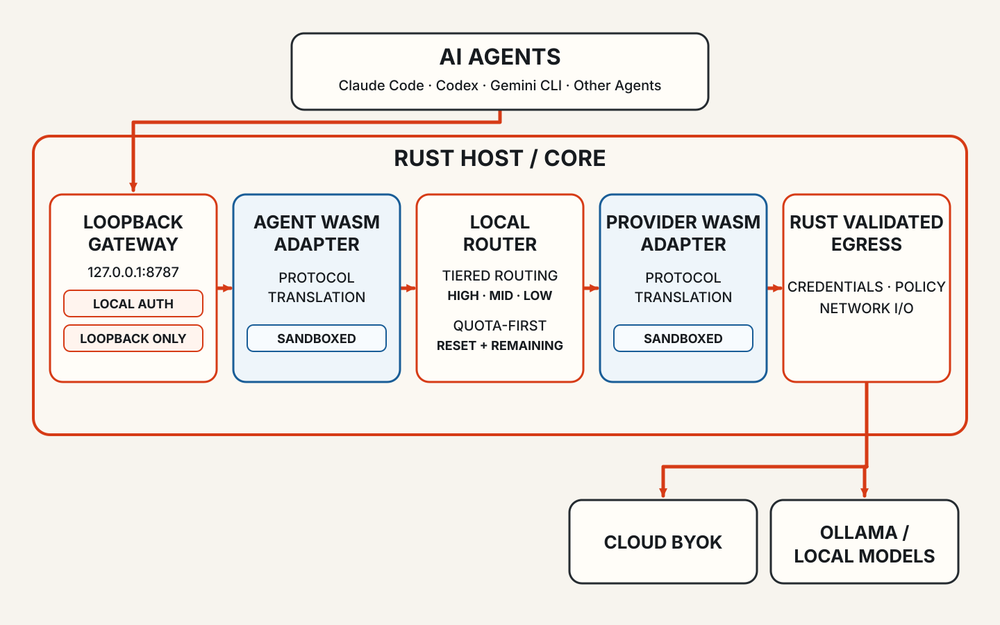

<div align="center">
  

# Token Station

**One local gateway for every AI agent.**

Connect Claude Code, Codex, Gemini CLI, Cursor, and other agents to the models you control. Pin a provider, route by task, or use quota before it resets.

[](https://github.com/ballast-ai/token-station/releases/latest) [](https://github.com/ballast-ai/token-station/actions/workflows/ci.yml) [](LICENSE)

[Download](https://github.com/ballast-ai/token-station/releases/latest) · [Quick start](#quick-start) · [Docs](docs/README.md) · [Issues](https://github.com/ballast-ai/token-station/issues) · [简体中文](README.zh-CN.md)
</div>

<p align="center">
  <picture>
    <source media="(max-width: 600px)" srcset="docs/assets/token-station-architecture-en-mobile.svg">
    
  </picture>
</p>

## Highlights

- **Local by default.** The Rust gateway listens on `127.0.0.1:8787` and requires authentication. Agent request traffic leaves the device only when you route it to a cloud provider.
- **Three routes.** Direct pins one provider and model. Smart tiers picks High, Mid, or Low in a single decision. Quota first spends buckets that reset sooner.
- **Enterprise-managed routing.** Enter an enterprise Base URL and credential once. The enterprise service keeps control of its real models and routing policy.
- **Your providers.** Start from 40+ editable presets, add a custom OpenAI-compatible endpoint, or keep work on a local runtime such as Ollama.
- **Desktop and CLI.** Both share the same Rust core. Usage, latency, cost estimates, and request logs stay on this machine.
- **Reversible connectors.** Connect writes a bounded plan and a private snapshot. Disconnect removes only Token Station fields.
- **Sandboxed adapters.** Official WASM plugins cover Anthropic Messages, OpenAI Chat Completions, OpenAI Responses, Gemini, and OpenAI-compatible providers. They have no network, filesystem, or credential access.

## Agents

<table>
  <tr>
    <td align="center" width="16%">
      <a href="https://github.com/anthropics/claude-code"><br>Claude Code</a>
    </td>
    <td align="center" width="16%">
      <a href="https://github.com/anthropics"><br>Claude Desktop</a>
    </td>
    <td align="center" width="16%">
      <a href="https://github.com/openai/codex"><br>Codex</a>
    </td>
    <td align="center" width="16%">
      <a href="https://github.com/google-gemini/gemini-cli"><br>Gemini CLI</a>
    </td>
    <td align="center" width="16%">
      <a href="https://github.com/xai-org/grok-cli"><br>Grok Build</a>
    </td>
    <td align="center" width="16%">
      <a href="https://github.com/MoonshotAI/kimi-code"><br>Kimi Code</a>
    </td>
  </tr>
  <tr>
    <td align="center">
      <a href="https://github.com/deepseek-ai/deepseek-harness"><br>DeepSeek Harness</a>
    </td>
    <td align="center">
      <a href="https://github.com/NousResearch/hermes-agent"><br>Hermes Agent</a>
    </td>
    <td align="center">
      <a href="https://github.com/openclaw/openclaw"><br>OpenClaw</a>
    </td>
    <td align="center">
      <a href="https://www.workbuddy.ai/"><br>WorkBuddy</a>
    </td>
    <td align="center">
      <a href="https://github.com/anomalyco/opencode"><br>OpenCode</a>
    </td>
    <td align="center">
      <a href="https://github.com/cursor/cursor"><br>Cursor</a>
    </td>
  </tr>
</table>

Eleven agents use a built-in connector. Cursor uses a dedicated setup on macOS and Windows. See the [guides](docs/guides/) and [reference](docs/reference.md#agents) for protocols and connector notes.

## Quick start

You need a provider API key or a local model endpoint. Token Station does not import agent subscriptions or OAuth sessions.

1. Download the latest build from [Releases](https://github.com/ballast-ai/token-station/releases/latest).
2. Open Token Station and add a provider. Use a preset or a custom OpenAI-compatible endpoint.
3. On **Home**, set the global route to Direct, Smart tiers, or Quota first.
4. For a built-in connector, select a detected agent and click **Connect**. Configure Cursor through its dedicated setup flow.
5. Send a request from the agent. Inspect the result in **Usage**.

The default listen address is `127.0.0.1:8787`.

On macOS, closing the window hides the app. The gateway keeps running until you quit from the menu bar.

## Install from source

Desktop development needs Rust stable (MSRV 1.96), Node.js 22.23.1, and the `wasm32-wasip2` target.

```bash
git clone https://github.com/ballast-ai/token-station.git
cd token-station
rustup target add wasm32-wasip2
npm --prefix apps/desktop ci
npm --prefix apps/desktop run tauri:dev
```

```bash
# CLI
cargo build -p token-station-cli
./target/debug/token-station-cli --help
```

A normal Cargo build does not embed the official adapters. Use `scripts/build-release.sh <target-triple>` for a packaged CLI. On macOS, `scripts/install-local-desktop.sh` builds, audits, and installs a local desktop app.

Use the assets listed on the selected [release](https://github.com/ballast-ai/token-station/releases/latest) page. Signing and notarization vary by build.

## Security

- The gateway rejects non-loopback listen addresses. Local authentication is on by default.
- Provider credentials default to an owner-only `secrets.json`. They do not appear in logs or plugins.
- Desktop request logs store prompt and response bodies as owner-only plaintext. Receipts and metrics do not.
- A cloud provider still receives any request you route to it.

The full boundary table is in the [reference](docs/reference.md#security).

## Documentation

- [Documentation index](docs/README.md)
- [Enterprise managed routing](docs/guides/enterprise-managed-routing.md)
- [Agent guides](docs/guides/)
- [Reference](docs/reference.md)

## License

Licensed under the [Apache License 2.0](LICENSE).
