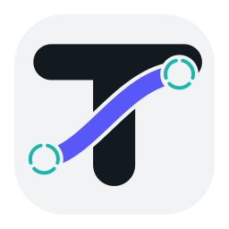
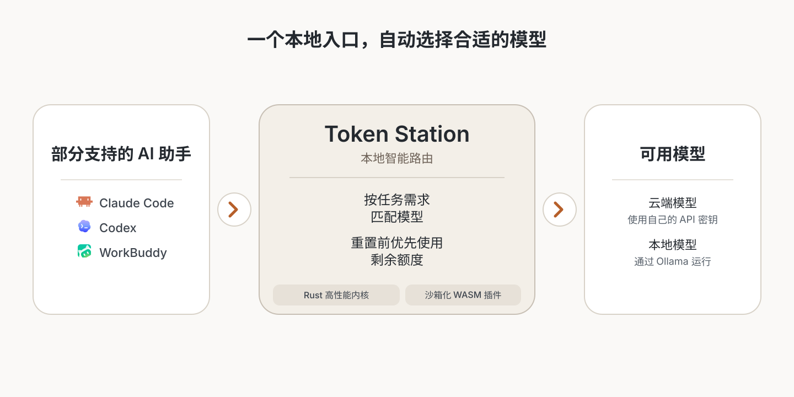

<div align="center">
  

# Token Station

**每个 AI Agent，共用一个本地网关。**

把 Claude Code、Codex、Gemini CLI、Cursor 接到你自己控制的模型上。固定供应商、按任务分档，或在额度重置前把配额用完。

[](https://github.com/ballast-ai/token-station/releases/latest) [](https://github.com/ballast-ai/token-station/actions/workflows/ci.yml) [](LICENSE)

[下载](https://github.com/ballast-ai/token-station/releases/latest) · [快速开始](#快速开始) · [文档](docs/README.md) · [提交问题](https://github.com/ballast-ai/token-station/issues) · [English](README.md)
</div>

<p align="center">
  <picture>
    <source media="(max-width: 600px)" srcset="docs/assets/token-station-architecture-zh-mobile.svg">
    
  </picture>
</p>

## 特点

- **默认只走本机。** Rust 网关监听 `127.0.0.1:8787`，并默认开启鉴权。只有主动路由到云供应商时，Agent 请求流量才会离开设备。
- **三种路由。** 单独路由固定一个供应商和模型。智能分档一次选定高、中、低档。额度优先先消耗更早重置的额度桶。
- **企业托管路由。** 只需填写企业 Base URL 和凭据。真实模型和路由策略继续由企业服务管理。
- **你的供应商。** 从 40 多个可编辑预设开始，也可添加自定义 OpenAI 兼容端点，或把工作留在 Ollama 等本地运行时。
- **桌面端与 CLI。** 共用同一套 Rust 内核。用量、延迟、成本估算和请求日志都留在本机。
- **可逆接入。** 一键接入会写入边界明确的变更计划，并保存私有快照。断开时只移除 Token Station 自己的字段。
- **沙箱适配器。** 官方 WASM 插件覆盖 Anthropic Messages、OpenAI Chat Completions、OpenAI Responses、Gemini 和 OpenAI 兼容供应商。适配器不能访问网络、文件系统或凭证。

## 支持的 Agent

<table>
  <tr>
    <td align="center" width="16%">
      <a href="https://github.com/anthropics/claude-code"><br>Claude Code</a>
    </td>
    <td align="center" width="16%">
      <a href="https://github.com/anthropics"><br>Claude Desktop</a>
    </td>
    <td align="center" width="16%">
      <a href="https://github.com/openai/codex"><br>Codex</a>
    </td>
    <td align="center" width="16%">
      <a href="https://github.com/google-gemini/gemini-cli"><br>Gemini CLI</a>
    </td>
    <td align="center" width="16%">
      <a href="https://github.com/xai-org/grok-cli"><br>Grok Build</a>
    </td>
    <td align="center" width="16%">
      <a href="https://github.com/MoonshotAI/kimi-code"><br>Kimi Code</a>
    </td>
  </tr>
  <tr>
    <td align="center">
      <a href="https://github.com/deepseek-ai/deepseek-harness"><br>DeepSeek Harness</a>
    </td>
    <td align="center">
      <a href="https://github.com/NousResearch/hermes-agent"><br>Hermes Agent</a>
    </td>
    <td align="center">
      <a href="https://github.com/openclaw/openclaw"><br>OpenClaw</a>
    </td>
    <td align="center">
      <a href="https://www.workbuddy.ai/"><br>WorkBuddy</a>
    </td>
    <td align="center">
      <a href="https://github.com/anomalyco/opencode"><br>OpenCode</a>
    </td>
    <td align="center">
      <a href="https://github.com/cursor/cursor"><br>Cursor</a>
    </td>
  </tr>
</table>

其中 11 个 Agent 使用内置 Connector。Cursor 的独立接入目前只支持 macOS。协议与接入细节见 [指南](docs/guides/) 和 [参考](docs/reference.zh-CN.md#agent)。

## 快速开始

你需要一个供应商 API Key，或一个本地模型端点。Token Station 不会把 Agent 订阅或 OAuth 会话导入成供应商账户。

1. 从 [Releases](https://github.com/ballast-ai/token-station/releases/latest) 下载最新版本：macOS 使用 DMG，Windows 使用 MSI，x86_64 Linux 可选 AppImage、DEB 或 RPM。
2. 打开 Token Station，添加供应商。使用预设，或填写自定义 OpenAI 兼容端点。
3. 在 **主页** 将全局路由设为单独路由、智能分档或额度优先。
4. 对内置 Connector，选择已发现的 Agent 并点击 **一键接入**。Cursor 请使用独立接入流程。
5. 从该 Agent 发起一次请求，然后在 **用量** 中查看结果。

默认监听地址是 `127.0.0.1:8787`。

在 macOS、Windows 和 Linux 上，关闭窗口只会隐藏 App，网关仍会继续运行。可通过菜单栏/系统托盘图标恢复窗口，也可以再次启动 Token Station；单实例机制会唤起已有进程。只有在原生菜单中选择“退出 Token Station”才会结束进程。macOS 和 Windows 支持带签名的应用内更新；Linux 仍需从 Releases 手动更新。Windows v2.0.0 需要手动升级一次，安装首个支持应用内更新的版本。

## 从源码安装

桌面开发需要 Rust Stable（MSRV 1.96）、Node.js 22.23.1，以及 `wasm32-wasip2` Target。

```bash
git clone https://github.com/ballast-ai/token-station.git
cd token-station
rustup target add wasm32-wasip2
npm --prefix apps/desktop ci
npm --prefix apps/desktop run tauri:dev
```

```bash
# CLI
cargo build -p token-station-cli
./target/debug/token-station-cli --help
```

常规 Cargo 构建不会内嵌官方适配器。打包 CLI 请使用 `scripts/build-release.sh <target-triple>`。在 macOS 上，`scripts/install-local-desktop.sh` 会构建、审计并安装本地桌面 App。

请以所选 [Release](https://github.com/ballast-ai/token-station/releases/latest) 页面列出的产物为准。签名与公证状态因构建而异。

## 安全

- 网关拒绝非回环监听地址，并默认开启本地鉴权。
- 供应商凭证默认保存在仅当前用户可读的 `secrets.json` 中，不会进入日志或插件。
- 桌面端请求日志会把 Prompt 和 Response 正文存为仅当前用户可读的明文。收据和指标不包含正文。
- 路由到云供应商的请求，仍会发给该供应商。

完整边界表见 [参考](docs/reference.zh-CN.md#安全)。

## 文档

- [文档索引](docs/README.md)
- [企业托管路由](docs/guides/enterprise-managed-routing.md#企业托管路由)
- [Agent 接入指南](docs/guides/)
- [参考](docs/reference.zh-CN.md)

## 许可证

本项目采用 [Apache License 2.0](LICENSE)。
