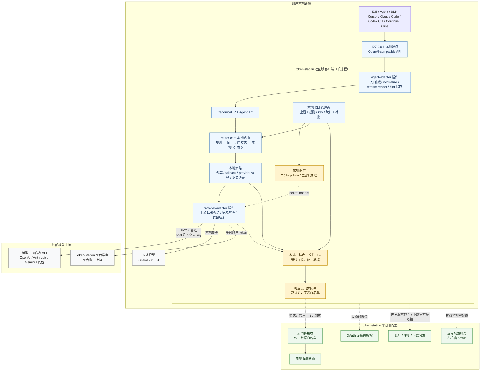

# 个人模式本地客户端概要设计

> 场景：基于 [个人模式本地客户端需求](../features/个人模式本地客户端需求.md)（2026-07-08 收口，同日二次修订：取消界面包与本地 Web 界面、指标库默认开启、企业网关上游降远期；四次修订：当前三类上游、闭源信任验收、配置冲突与云同步白名单；**2026-07-09 五次修订：开核开源口径统一**——社区版开源分发（Apache-2.0）、任意下载、注册解锁云功能，原闭源分发表述作废）的概要设计，覆盖客户端本体、平台侧配套两块的组件划分、关键流程与安全设计。详细设计（接口字段、表结构全量）另起文档。
>
> 整理日期 2026-07-08。上游约束来源：[智能路由能力](../features/智能路由能力.md)（个人模式路由决策必须本地完成）、[用户信任与数据监控](../../../glm5.2-platform/docs/business/glm-5.2-用户信任与数据监控.md)（对账验证规格，集成接口）。隐私梯度 L1/L2/L3 为术语借用，定义见 glm5.2-platform [服务模式定位](../../../glm5.2-platform/docs/business/glm-5.2-服务模式定位.md) §四（该文档与本产品无直接上下位关系，2026-07-08 拍板）。

---

## 一、目标与范围

**目标**：交付一个开核开源的本地客户端（社区版，Apache-2.0，任意下载、可自行构建，2026-07-09 口径统一），让个人用户在本地完成「多上游混合路由 + 隐私可控的用量观测」。「四种服务模式统一接入端」的叙事保留，但企业网关上游降为远期观察项（2026-07-08 二次修订），当前覆盖 BYOK 直连 / 本地模型 / 平台账户三类上游。

| 范围内 | 范围外 |
|--------|--------|
| 客户端本体（本地代理 + 命令行，含默认开启的指标库与简统计命令） | 本地 Web 界面 / 界面包（2026-07-08 二次修订拍板：取消） |
| 平台侧配套（下载分发、设备码授权、云同步接收、用量报表网页） | 企业/小 Team 网关上游接入（2026-07-08 二次修订：降为远期观察项）及网关本身设计 |
| 本地对账命令（消费只读账单 API） | 平台模式服务端计费（归 glm5.2-platform / token-station 服务端各自计费文档） |
| | 学习型路由器的云端训练与数据飞轮（见智能路由能力 §③）；对账验证规格本身（由 glm5.2-platform 信任文档定义） |

**核心设计约束（来自已拍板需求，设计不得违反）**：

1. 本地直连路径只能用个人 key，平台批发 key 永不下发到本地（需求 §二）；
2. 路由决策全部本地完成，内容不发给任何云端分类器（智能路由能力 §四，L2 承诺）；
3. 原始请求/响应内容永不上传，无开关（需求 §三）；
4. 指标库默认内置开启，数据仅存本地，未开云同步不出设备（需求 §三，2026-07-08 二次修订）；
5. 开核开源、任意下载，注册解锁云功能（2026-07-09 口径）；官方安装包签名分发 + 可复现构建、升级显式确认；L2/L3 隐私验收以源码公开 + 可复现构建为主，网络边界、字段白名单、本地审计与离线可用为纵深（需求 §二/§五）。

---

## 二、总体架构

```
┌─────────────────────── 用户本地设备 ───────────────────────┐
│                                                            │
│  调用方（IDE / Agent / SDK，走 OpenAI 兼容协议）             │
│      │                                                     │
│      ▼ 127.0.0.1 本地端点                                   │
│  ┌──────────────────── 客户端本体（单进程） ──────────────┐  │
│  │  ① 接入层    OpenAI 兼容端点 + /v1/models             │  │
│  │  ② 路由引擎  规则 → hint → 启发式 → 内嵌小分类器(本地) │  │
│  │  ③ 上游适配  BYOK直连 / 本地模型 / 平台端点            │  │
│  │  ④ 密钥保管  个人 key / refresh token 加密存储         │  │
│  │  ⑤ 数据层    文件日志（始终）· 指标库（默认开启）        │  │
│  │  ⑥ 同步模块  可选云同步（默认关，仅元数据）              │  │
│  └───────┬──────────────┬───────────────┬───────────────┘  │
└──────────┼──────────────┼───────────────┼──────────────────┘
           │①BYOK直连      │②本地模型       │③经平台端点
           ▼              ▼               ▼
      模型厂商官方API   Ollama/vLLM      平台端点
                                          ▲
┌────────────────── token-station 平台侧配套 ─────────────────┐
│  账号与注册 · 下载分发服务（本体签名分发） · OAuth 设备码授权  │
│  云同步接收接口 · 用量报表网页（多设备归集查看）               │
└─────────────────────────────────────────────────────────────┘
```

### 2.1 架构图（Mermaid）



要点：

- **单进程本地代理**：客户端本体是一个常驻本地进程（含命令行入口），对外只监听 `127.0.0.1`，调用方以 OpenAI 兼容协议接入——对 IDE/Agent 而言它就是一个「本地的 OpenRouter」。
- **无本地 Web 界面（2026-07-08 二次修订拍板）**：本地管理面只有命令行 + 配置文件；云端平台网页可管理非机密配置并由本地主动拉取；指标库随本体内置、默认开启（仅本地）；用量报表在平台网页，前提是绑定账号 + 开启云同步。原界面服务、包管理器两个组件删除。
- **企业/小 Team 网关上游（原④类）降为远期观察项**：不进 C1–C3，视企业模式进展再排期；协议上它只是又一个 OpenAI 兼容上游，未来接入成本极小。
- **平台侧配套是薄层**：只做账号、分发、授权、同步接收与报表展示，不碰请求数据面。

---

## 三、组件设计

### 3.1 接入层

- OpenAI 兼容 `chat/completions`（含流式）+ `/v1/models`（聚合三类当前上游的可用模型目录）。
- 接受客户端 hint header（Agent 步骤类型等，见智能路由能力第 ⑥ 档），传给路由引擎。
- Anthropic Messages 等其他协议端点跟随 token-station 服务端的协议层规划（服务端 Anthropic Messages 已于 2026-07-08 拍板升 🔴，见[功能需求清单 §一](../features/token-station功能需求清单.md)），客户端复用同一套互译实现（客户端侧维持 🟡 非首版，是否随服务端提前另拍）。

### 3.2 路由引擎（全本地）

按智能路由能力已拍板的四层裁剪出**本地子集**：

| 层 | 本地实现 | 说明 |
|----|---------|------|
| 用户规则 | 本地规则文件或远程配置 profile | 规则**配置**可从服务端 Preset 拉取同步（配置下行，非内容上行），执行永远在本地；远程配置需用户显式开启 |
| hint | 消费调用方 header | 客户端比网关更知道 Agent 步骤类型 |
| 启发式打分 | token 数/代码块/工具定义等特征 | 纯本地计算 |
| 小分类器 | 内嵌本地小模型（几十 MB，随客户端本体分发更新） | 权重本地加载，内容不出设备 |

级联兜底（第 ④ 层）不进个人版首版：双份调用成本由个人承担，性价比差。

### 3.3 上游适配层

| 上游 | 适配要点 |
|------|---------|
| ① BYOK 直连 | 各厂商官方 API 适配器；只能绑定个人 key |
| ② 本地模型 | Ollama / vLLM 的 OpenAI 兼容端点直通 |
| ③ 平台账户 | OAuth 设备码授权换取平台 token；流量经平台端点按平台计费 |
| ④ 企业/小 Team 网关 | **2026-07-08 二次修订：降为远期观察项，不进 C1–C3**。届时配置企业网关地址 + 成员凭证即可，协议上等同一个 OpenAI 兼容上游 |

统一的上游健康检查与失败切换（简化版：超时/错误计数 → 临时摘除 → 恢复探测），不引入服务端那套三层容灾。

### 3.4 数据层（2026-07-08 二次修订：取消两态，指标库默认开启）

| 数据 | 形态 |
|------|------|
| 文件日志 | 始终写：滚动文本（请求时间、模型、上游、状态码、耗时），本地轮转 |
| 指标库 | 本地嵌入式数据库（SQLite 类），**随客户端本体内置、首启即建、默认开启**（命令行可关）；存元数据明细与聚合：模型、token 数、延迟、路由决策与命中规则、错误、逐请求成本估算。默认开启的理由是数据仅本地、隐私代价低且用户可关闭 / 删除，同时保证云同步与对账的历史完整 |
| 原始请求/响应内容 | 默认不落盘；可经命令行开启「本地调试留存」（仅本地、限期自动清理），**任何情况下不上传** |

- 逐请求成本估算依赖**定价表**：经配置通道下发（数据下行），本地计算。
- 指标库同时是对账命令的本地计量底账（信任文档「本地独立计量」的载体）与云同步的数据源。

### 3.5 本地 Web 界面与界面包（2026-07-08 二次修订拍板：取消）

个人版不提供本地 Web 管理界面；界面服务、包管理器及界面包签名 / 版本锁定 / 回退机制整体取消。直接收益：「服务器下发远程界面代码」的风险面消失，本地无 HTTP 管理服务、浏览器攻击面归零。客户端本体安装包签名 + 用户显式升级只承担分发安全；L2/L3 隐私验收以源码公开 + 可复现构建为主（2026-07-09 开核口径），网络边界、同步字段白名单、本地审计输出与离线可用为纵深（见 §六）。用量的可视化查看移至平台网页（见 §3.7、§五）。

### 3.6 管理面：命令行是唯一本地管理面

**原则：本地管理能力由命令行 + 配置文件承担**（2026-07-08 二次修订：无本地 Web 界面）。云端平台网页只管理非机密配置，且必须由用户显式开启远程配置后才成为生效来源。

两种 key 的生成与管理（都不依赖云端）：

| key | 生成位置 | 管理方式 |
|-----|---------|---------|
| **本地虚拟 key**（调用方连 `127.0.0.1` 端点的凭证） | **首次启动自动生成默认 key**，打印到终端并写入本地配置 | CLI：`key create / list / revoke`；默认开启鉴权，可显式关闭（单人设备场景） |
| **上游个人 key**（BYOK） | 用户在各模型厂商官网生成 | CLI：`upstream add <provider> --key ...`，经密钥保管组件加密入库（措施见 §六） |

CLI 同样覆盖：上游增删与测活、本地路由规则编辑（指向本地 profile）、远程配置开关、指标库开关、云同步开关、**简单用量统计命令**（用量 / 错误 / 延迟 / 成本汇总，读本地指标库）、本地对账命令（C3，见 §3.8）、本体升级检查。

配置生效规则：默认使用本地 profile；开启远程配置后，云端 profile 对路由规则、上游定义、配额等非机密配置生效，本地只保留密钥映射与最后一次成功拉取的云端配置缓存；关闭远程配置后回到本地 profile。云端配置必须版本化、可回滚、可导出。

### 3.7 云同步模块（可选，默认关）——多设备用量管理的机制

- 开关经命令行显式开启（需先绑定账号，未绑定则触发设备码授权）；同步内容 = 指标库中的元数据聚合与明细（字段白名单硬编码，内容字段在代码层面不存在于同步路径）。
- 白名单字段：设备匿名标识、时间段、上游引用名、模型名、token 数、延迟、状态码 / 错误码、路由命中规则 ID、成本估算、客户端版本；错误字段只允许结构化错误码与脱敏后的上游错误类别。
- 断点续传、批量上报；服务端按账号归集，经**平台网页用量报表**提供多设备查看（2026-07-08 拍板：用量报表以平台网页为主，本地保留命令行简统计）。
- 上报数据不作计费凭证（服务端仅存储展示，不入账务）。

### 3.8 对账命令（命令行功能，C3）

- 经设备码授权的只读 Usage/Logs API 拉取平台账单明细 → 与本地指标库逐条 diff → 终端输出差异报告（token 计数、预扣/结算差异）。
- 对账的意义是独立于平台的核验，不能搬到平台网页（自己验自己），故保留在本地命令行（2026-07-08 拍板）。
- 对账对象按上游区分：token-station 平台账户上游对 token-station 自有账单；glm5.2-platform 作为被集成方时对其只读 Usage/Logs；其他上游只有在提供只读账单接口时才纳入。本设计只负责账单 schema 适配、「拉取 + diff + 输出」，不定义各平台账单真实性规则。

---

## 四、关键流程

### 4.1 下载 → 激活 → 注册解锁云功能（2026-07-09 修订：注册后移）

```
任意下载客户端安装包（官网 / GitHub release，官方签名包；开源可自行构建；安装包为通用二进制，不内嵌账号信息）
→ 首次启动：自动生成默认本地虚拟 key（打印到终端 + 写入本地配置）+ 创建本地指标库（默认开启，仅本地）
→ CLI 配置上游（BYOK key / 本地模型地址）→ 即可开始使用（零账号绑定）
→ 设备码授权【懒触发】：首次启用平台账户上游 / 云同步 / 对账命令 / 拉取规则预设时才要求注册绑定（注册钩子在云功能，不在下载）
→ 可选：开启云同步（多设备用量管理）→ 平台网页查看归集后的用量报表
```

**绑定口径（2026-07-08 拍板）**：

1. **不设账号绑定票据**：安装包是通用二进制，账号绑定只走 OAuth 设备码授权一条路。理由：票据与设备码功能重复，且内嵌票据需动态打包、安装包转发即泄露凭证。
2. **设备码授权懒触发，非首启必经**：纯 BYOK / 本地模型用户裸用全程零绑定（注册仅作为下载门槛）。理由：强制绑定削弱「直连对平台零可见」的 L2 隐私卖点，且功能上无必要。

### 4.2 一次请求的生命周期

```
调用方 → 本地端点 → 路由引擎(规则→hint→启发式→分类器，全本地)
→ 选定模型与上游 → 密钥保管取 key → 上游适配发出请求（流式透传）
→ 写文件日志 + 指标库元数据明细（含路由决策与成本估算；指标库被显式关闭时仅文件日志）
→ 若云同步开启：入同步队列（仅元数据）
```

### 4.3 客户端本体升级

```
匿名版本检查（2026-07-08 拍板：不要求登录态，裸态零绑定用户可查新版本）→ 发现新版本提示
→ 用户显式确认（永不自动更新）
→ 下载安装包：任意下载官方签名包（2026-07-09 开源口径，无需登录；已绑定设备可凭 access token 客户端内直接下载）
→ 安装包签名校验（内置公钥）→ 替换二进制并重启 → 配置 / 密钥库 / 指标库全部保留
```

---

## 五、平台侧配套（token-station 服务端新增模块）

| 模块 | 职责 | 备注 |
|------|------|------|
| 账号与注册 | 复用 token-station 自有账号体系（功能需求清单 §五） | 不新建体系 |
| 下载分发服务 | 官方签名安装包的分发；版本管理与灰度；**版本检查接口与下载均匿名开放**（2026-07-09 开源口径：下载不再要求登录态） | 官方推荐渠道（开源可自行构建） |
| 签名发布流水线 | 客户端本体安装包构建 → 私钥签名 → 发布；私钥离线保管 | 公钥随客户端本体内置，供升级包校验；2026-07-08 二次修订后不再涉及界面包 |
| OAuth 设备码授权 | 客户端绑定账号；换发**统一 refresh token**（长效、加密存储于密钥保管组件），按 scope（平台端点调用 / 账单只读 / 安装包下载 / 云同步上报）换取短效 access token，静默续期 | 懒触发（2026-07-08 拍板，见 §4.1）；与 glm5.2-platform 的被集成接口同构 |
| 云同步接收与用量报表网页 | 接收元数据上报、按账号归集；**平台网页提供多设备用量报表**（2026-07-08 拍板：用量可视化以平台网页为主）；关闭同步只停止上报，**已归集数据保留不删除**（2026-07-08 拍板） | 明确不入账务系统 |
| 远程配置服务 | 管理非机密配置 profile（路由规则、上游定义、配额），提供版本化、回滚、导出与客户端拉取接口 | key 本体永不上云；客户端可关闭远程配置 |

---

## 六、安全设计要点

| 面 | 措施 |
|----|------|
| 个人 key 保管 | 本地加密存储（优先操作系统钥匙串，退化为主密码加密文件）；永不上传、不出现在日志；平台 refresh token 同等待遇 |
| 本地端点暴露面 | 仅 `127.0.0.1`；**无本地 Web 管理服务**（2026-07-08 二次修订），管理走命令行，浏览器跨站攻击面归零 |
| 本体分发安全 | 安装包私钥签名 + 客户端内置公钥校验升级包；升级永远显式确认、永不自动更新；**可复现构建**保证官方二进制可验证由公开源码编出（签名只证明发布者与包完整性，二者配合构成完整信任链） |
| 同步数据边界 | 同步路径字段白名单在代码层硬编码，内容字段结构性不可达；错误信息只同步结构化错误码与脱敏类别 |
| 网络边界审计 | 提供命令导出最近网络目的地与用途；关闭云同步和远程配置后，BYOK / 本地模型路径只访问用户配置的上游、本地模型端点和匿名版本检查 |
| 隐私承诺兑现 | BYOK/本地模型流量在关闭云同步时对平台零可见；开启后也仅元数据白名单（L2 不破）；本地路由和本地统计离线可用 |

---

## 七、技术选型建议（概要级，非拍板）

| 项 | 建议 | 理由 |
|----|------|------|
| 客户端本体 | Rust 单二进制 | 复用开源仓 `router-core`、`protocol`、`plugin-runtime` 与双端 adapter 插件机制；避免 Go/Rust 双实现导致路由行为漂移 |
| 指标库 | SQLite | 嵌入式、零运维、够用 |
| 安装包签名 | 签名清单（manifest + Ed25519） | 本体分发与升级校验（2026-07-08 二次修订：界面包取消，签名对象只剩本体） |
| 小分类器 | ONNX 格式随本体分发，本地推理 | 几十 MB 量级，权重更新走本体升级同一条签名通道 |

---

## 八、里程碑切分

| 阶段 | 交付 | 对应需求 |
|------|------|---------|
| **C1 最小可用** | 本地端点 + BYOK 直连 + 本地模型 + 规则/启发式路由 + 文件日志 + 指标库（默认开启）与命令行简统计 + 开源首发（任意下载、可复现构建、零绑定可用） | 需求 §一①②、§二、§三、§五 |
| **C2 账号与云端观测** | 设备码授权绑定（懒触发）+ 平台账户上游 + 云同步 + 平台网页多设备用量报表 + 定价表下发与成本估算 | 需求 §一③、§三云同步、§四 |
| **C3 完整形态** | 对账命令 + 内嵌小分类器路由 | 需求 §四对账、智能路由能力 §五 |

> 与 token-station 服务端 M1–M4 的关系：C1 依赖 P1 产出的 `router-core` 骨架、`protocol` / Canonical IR、双端 adapter 插件地基，以及账号/下载分发的最小配套；C2 依赖设备码授权、云同步接收与用量报表网页；C3 的对账依赖 glm5.2-platform 只读账单 API 就绪。企业网关上游（原 C3 项）已降为远期观察项，不在里程碑内（2026-07-08 二次修订）。
>
> **2026-07-09 补充（来自 [V2 开发计划](../planning/token-station-V2开发计划.md) §四）**：整体排期采用「先 P0-P1 公共地基，再启动 C1，并与 P2 共建路由能力」。C1 不等待 P2 完整结束；P1 的路由 crate 骨架先支撑本地规则/启发式最小子集，P2 再补服务端 DB 配置源与完整服务端集成。

---

## 九、待决问题

1. 本地调试留存原始内容的默认期限与上限（建议：默认关，开启后 7 天/500MB 自动清理）——详细设计定；
2. 平台账户上游是否首版就支持订阅额度展示（依赖平台侧接口排期）；
3. 小分类器是否随 C2 提前（取决于蒸馏产出时间，见智能路由能力 §五路线图第 3 步）。

> 原「界面包与客户端本体的版本兼容矩阵」待决项随界面包取消而作废（2026-07-08 二次修订）。

---

## 十、与既有文档的关系

| 文档 | 关系 |
|------|------|
| [个人模式本地客户端需求](../features/个人模式本地客户端需求.md) | 本设计的需求来源，约束全量继承 |
| [智能路由能力](../features/智能路由能力.md) | 路由引擎本地子集的方法学来源 |
| [用户信任与数据监控](../../../glm5.2-platform/docs/business/glm-5.2-用户信任与数据监控.md) | 对账工具验证规格的定义方 |
| [token-station 功能需求清单](../features/token-station功能需求清单.md) | §十客户端条目的设计展开；账号/计费复用 §五/§六体系 |
