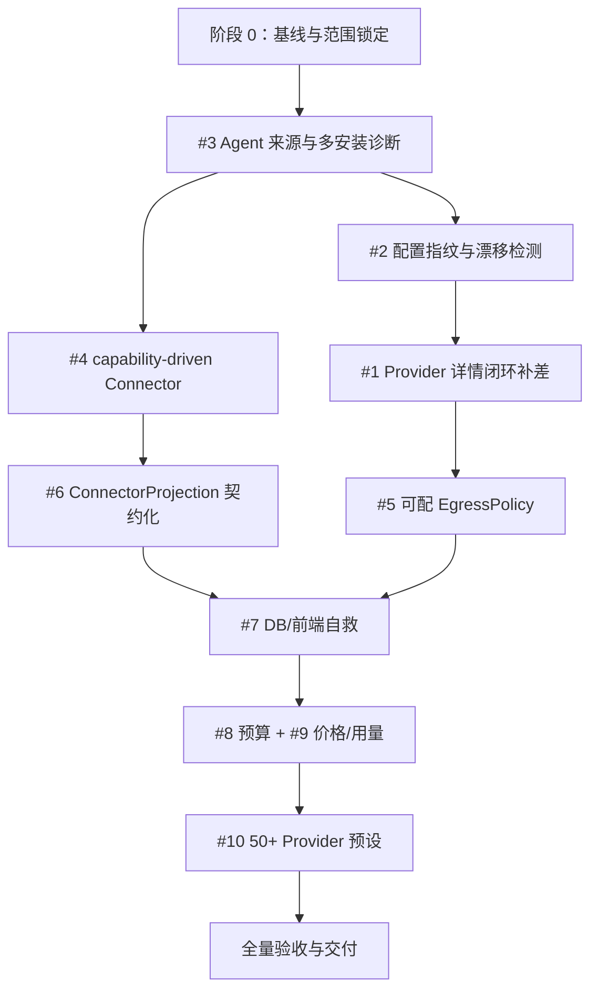

# 第二批协作任务：长期 Goal 执行方案

> 日期：2026-07-22
> 状态：10 项任务、最终全量门禁与 #7 隔离真实 App 验收全部通过；达到成功退出条件（2026-07-23）
> 工作区：仓库根目录
> 当前分支：`codex/agent-gateway-taskbook`
> 需求来源：`2026-07-22-第二批-协作任务包.md`
> 适用范围：`apps/desktop/`、`apps/cli/` 及直接相关的测试、设计和验收文档

## 1. 文档用途

本文把第二批 10 项协作需求转换为可持续执行、可验证、可退出的长期 Goal。它负责定义：

- 为什么做、最终要得到什么；
- 当前仓库已经具备什么、还缺什么；
- 各项工作的依赖关系和执行顺序；
- 每个阶段何时算通过；
- 哪些情况允许暂停或退出；
- 最终需要交付哪些代码、测试和验收证据。

本文不把“代码已存在”视为完成。所有完成结论必须来自当前提交上的 fresh verification，并在 `docs/verification/` 留下可复核证据。

## 2. 背景

Token Station 的产品定位是本地可编程 LLM 路由与 Agent 安全控制面。本批任务集中补齐三类能力：

1. **可理解的控制面**：Provider 全生命周期、Agent 多安装诊断、配置漂移、预算和用量都能被用户看见并对账。
2. **可扩展的接入架构**：Agent Connector 由能力声明驱动，新增 Agent 不再修改多处分支或核心枚举。
3. **可恢复的安全边界**：出站代理显式可配、配置投影可逆、数据库或前端异常时仍可进入自救壳。

当前仓库并非从零开始：Provider 生命周期、版本化目录、配置事务、加密快照、Agent Registry、结构化配置 patch、版本化价格内核和 fail-closed 出站基线已经存在。本 Goal 的原则是先核对现状，再补齐需求差距，不重写已通过验收的能力。

## 3. 当前实现基线

以下结论来自 2026-07-22 对当前工作树的静态检查，不等同于运行态验收结论。

| 编号 | 当前状态 | 已有基础 | 主要缺口 |
|---|---|---|---|
| #1 Provider 详情闭环 | 已完成本地实现与验证 | 同一详情入口覆盖编辑、最终 URL、八层真实测试、三色健康、可信目录、用量和软删除保护 | 自动化与独立 Debug App 证据见 `docs/verification/2026-07-22-第二批协作任务-T1Provider详情闭环验收.md` |
| #2 配置漂移检测 | 已完成本地实现与验证 | 接管前加密快照、所有权 HMAC、当前磁盘事实组成三方对账；只读 IPC 和 UI 展示字段路径及受管范围 | 真实外部配置漂移的人工冒烟留待最终总验收；自动化证据见 `docs/verification/2026-07-22-第二批协作任务-T2配置漂移验收.md` |
| #3 Agent 来源/多安装诊断 | 已完成本地实现与验证 | Registry + Scanner 现已返回精确路径、`binary_source`、mtime、完整 SHA-256、PATH 生效项和 Homebrew/npm 全局升级命令；多安装必须先明确选择且命令只能复制 | 真实多安装机器上的人工冒烟留待最终总验收；当前自动化证据见 `docs/verification/2026-07-22-第二批协作任务-阶段0与T3验收.md` |
| #4 capability-driven Connector | 已完成本地实现与验证 | Connector 模块自注册并声明平台、格式、路径、字段与入站适配器；CLI 命名空间由插件能力/显式路由驱动；前端入口遍历 Registry；已补 Claude Desktop 与 Gemini CLI | 自动化证据见 `docs/verification/2026-07-22-第二批协作任务-T4能力驱动Connector验收.md`；跨平台真实 App 冒烟留待最终总验收 |
| #5 EgressPolicy | 已完成本地实现与验证 | direct/HTTP CONNECT/SOCKS5、实际 `no_proxy` matcher、认证槽、运行态出口解释和固定直连更新检查已闭环；所有 client 拒绝重定向与环境代理污染 | 自动化证据见 `docs/verification/2026-07-22-第二批协作任务-T5EgressPolicy验收.md` |
| #6 ConnectorProjection | 已完成本地实现与验证 | 公开的多文件正/反向脱敏投影契约；精确值仅存在服务端非序列化 patch；credential slot 引用、diff 确认、加密快照恢复与并发校验闭环 | 自动化证据见 `docs/verification/2026-07-22-第二批协作任务-T6ConnectorProjection验收.md` |
| #7 自救页 | 已完成自动化与隔离真实 App 验收 | 业务状态注册前只读 schema 分流；独立自救 IPC/UI；三类前端异常本地结构化日志；字段/总量预算与二次脱敏；确认后 online snapshot/raw fallback 导出；实机发现并修复导出权限与诊断绝对路径泄露 | v99 源库哈希、schema 与 canary 全程不变；私有导出为目录 `0700`/文件 `0600`，诊断路径映射为 `$DATA_DIR`；详见 `docs/verification/2026-07-22-第二批协作任务-T7自救壳验收.md` |
| #8 预算预警 | 已完成本地实现与验证 | per-Agent 预算、固定周期聚合、未知价格/到期状态、黄条/徽章与按 Agent 聚合已闭环；真实代理集成测试证明超额不阻断 | 自动化证据见 `docs/verification/2026-07-22-第二批协作任务-T8预算预警验收.md` |
| #9 价格 UI/Agent 过滤 | 已完成本地实现与验证 | 不可变追加 price version、expected-version 并发保护、显式零价、历史 Receipt 不回算、Agent/入站协议来源组合过滤和编辑器已闭环 | 自动化证据见 `docs/verification/2026-07-22-第二批协作任务-T9价格编辑器与用量过滤验收.md` |
| #10 50+ Provider 预设 | 已完成本地实现与验证 | 默认目录 52 项；按协议/区域/订阅分组；50 个唯一官方证据 URL 已核验；聚合候选与默认目录隔离 | 设计与证据见 `docs/design/2026-07-22-50+Provider预设分类与收录设计.md`、`docs/verification/2026-07-22-第二批协作任务-T10供应商预设验收.md` |

工作区开始时已有以下未跟踪文件，均视为用户资产，不覆盖、不删除、不擅自暂存：

- `.superpowers/`
- `docs/superpowers/plans/2026-07-20-agent-discovery-version-compatibility.md`
- `docs/superpowers/specs/2026-07-20-agent-discovery-version-compatibility-design.md`
- `token-station.state.json`

## 4. Goal 目标

### 4.1 总目标

在不破坏现有路由数据面和安全边界的前提下，完成第二批 10 项控制面能力，使 Provider、Agent、本机配置、出站路径、成本和故障恢复都具备清晰、可逆、可诊断、可验证的产品闭环。

### 4.2 产品目标

1. 用户在一个详情入口内完成 Provider 的增、改、测、目录、用量和安全删除。
2. 用户能区分接管前配置、Token Station 最后写入配置和当前磁盘配置，并看到字段级漂移。
3. 多份 Agent 安装同时存在时，用户能知道当前生效项、接管目标和对应升级命令。
4. 新增 Agent 主要通过能力声明与 Connector 模块完成，上层 UI 和控制面自动生成入口。
5. 企业网络用户能显式配置出口并知道请求实际走哪条路径。
6. Agent 配置只做字段级、可逆投影，不覆盖未知字段，不落真实上游凭据。
7. DB 版本不兼容或前端崩溃时，应用仍可导出脱敏诊断并执行有限自救动作。
8. 用户能看到 per-Agent 预算预警、版本化价格和按 Agent/来源过滤的用量。
9. 官方直连 Provider 预设达到 50+，每项有可追溯的官方依据。

### 4.3 工程目标

- 所有外部配置写入保持原子、可回滚、有所有权边界。
- 所有新增敏感字段只保存 credential slot 引用，不在配置、IPC、日志或前端状态中出现明文。
- 所有出站请求遵守重定向和鉴权头红线。
- 所有新增架构通过契约测试证明“新增 Agent 不修改中心枚举/前端分支”。
- 所有功能具备单元测试、集成测试；需要真实 UI/运行态验证的功能保留截图或操作证据。

## 5. 范围与边界

### 5.1 本 Goal 范围

- `apps/desktop/src/**`：详情页、漂移面板、安装诊断、动态 Agent 入口、出站配置、自救壳、预算/价格/用量 UI、Provider 预设。
- `apps/desktop/src-tauri/**`：指纹与三方对账、Agent 诊断与 Connector、结构化投影、诊断命令、桌面配置持久化。
- `apps/cli/**`：可配置 EgressPolicy、用量/预算/价格聚合与必要的稳定接口。
- 与上述改动直接相关的 fixtures、测试、设计文档和验收记录。

### 5.2 明确排除

1. T7 分层挂载补全和模型 Capability `bool → 四态枚举` 改造。本 Goal 只能消费现有四态，不修改其定义。
2. 可安装/签名发布门，包括路径脱源码、插件嵌入和签名。
3. 版本准入删三块，包括远程目录、verified 白名单和不可解析版本硬拦。
4. 自动执行 Agent 升级命令。
5. 预算超限后阻断请求。
6. 聚合站仅因竞品已收录就默认加入 Provider 目录。
7. 与本批需求无关的 `crates/router-core/**` 改动、路由算法改造或协议 IR 扩展。

### 5.3 不变量

- 漂移检测只展示事实，不自动覆盖磁盘配置。
- 多安装冲突未选择精确路径前，不允许接管或恢复。
- 跨主机请求不转发原 `Authorization`；所有 3xx 默认拒绝并显式报告。
- Provider 目录刷新不静默删除仍被 Pool 或 Agent 引用的模型。
- 价格编辑只产生新 `price_version`，不回算历史请求。
- 前端错误和诊断日志不自动上报；导出必须由用户确认。
- JSON5、YAML、TOML 和 JSON/JSONC 修改必须保留非受管字段。

## 6. 依赖关系与执行顺序



执行原则：同一阶段只有在前置数据契约稳定后才进入后续阶段。不存在依赖冲突的测试、文档或纯数据工作可以穿插，但不能以并行推进为由绕过前置验收。

## 7. 执行步骤

### 阶段 0：基线与范围锁定

> 状态：已完成（2026-07-22）。基线命令、一次并发 fixture 抖动及最终复验记录见阶段验收文档。

1. 记录分支、HEAD、工作区脏文件和工具链版本。
2. 对照当前 `develop`/目标基线确认本分支是否已经包含需求依赖，不自动合并或重置用户工作。
3. 运行最小基线测试，区分“任务引入失败”和“开始前已有失败”。
4. 为 10 个子项建立“需求—代码—测试—验收证据”追踪表。
5. 对已有 #1、#3、#4、#6 做差距复核，禁止重复造同名数据模型。

阶段通过条件：基线失败、用户文件、现有契约和每项准确改动范围均已记录；没有把静态检查误写成测试通过。

### 阶段 1：#3 Agent 来源、多安装与升级位置识别

> 状态：已完成本地实现与自动化验证（2026-07-22）。

1. 扩展只读 Discovery 结果，加入标准化 `binary_source`、文件 mtime、SHA-256 和发现证据。
2. 明确当前生效项算法：PATH 顺序、canonical path 去重、shim/包管理器来源和平台边界必须可解释。
3. 将“接管目标配置”绑定到用户选择的精确安装路径，计划生成和应用时再次校验。
4. 按来源生成结构化升级建议，例如 Homebrew、npm global 或手工安装；建议只允许显示和复制。
5. 添加 macOS/Linux/Windows/WSL fixtures，覆盖重复路径、失效 shim、多个版本和路径变化。
6. 前端展示全部安装点、来源、版本、mtime、短哈希、生效项和升级建议，不提供“执行升级”按钮。

阶段通过条件：多安装全部列出且生效项判定可解释；未选择精确路径时所有写操作 fail-closed；升级命令从未被执行。

### 阶段 2：#2 配置指纹与三方漂移检测

> 状态：已完成本地实现与自动化验证（2026-07-22）。设计契约见 `docs/design/2026-07-22-配置指纹与三方漂移检测设计.md`，验收证据见 `docs/verification/2026-07-22-第二批协作任务-T2配置漂移验收.md`。

1. 复用接管前加密快照作为 `baseline`，复用所有权记录中的 managed hash 作为 `last_managed`，读取当前文件形成 `current`。
2. 定义三态结果：未接管、无漂移、已漂移；文件缺失、不可解析、格式变化必须单独表示。
3. 使用结构化解析器计算字段级 diff，按 JSON Pointer/等价结构路径展示；值经过敏感字段掩码。
4. 新增只读后端命令和前端漂移面板。扫描或打开面板不得写外部配置。
5. “重新接管”必须重新生成变更计划并走确认流程；“保留外部改动”不得伪造为已接管状态。
6. 测试外部增、删、改字段，未知字段、密钥字段、格式错误和文件删除。

阶段通过条件：外部修改后能准确指出字段；三份事实来源可区分；检测动作零写入、零明文泄漏、零自动覆盖。

### 阶段 3：#1 Provider 详情闭环补差

> 状态：已完成本地实现、全量自动化验证与真实 Debug App 复验（2026-07-22）。证据见 `docs/verification/2026-07-22-第二批协作任务-T1Provider详情闭环验收.md`。

1. 以现有 T8 和 `ProviderModelManager` 为基础做 gap-only 改造。
2. 将 Add/Edit、最终 URL、分层测试、健康徽章、目录版本/diff、用量、引用和软删除组织为同一详情入口。
3. 后端分层测试统一返回 layer、status、duration、detail；DNS、TLS、鉴权、models、流式、tool、JSON 均保持诚实状态。
4. 健康徽章定义为：全关键层通过为绿；可用但存在能力失败/缓存退化为黄；基础连通或鉴权失败为红。徽章必须可追溯到最近一次测试时间。
5. 目录沿用 active/stale/removed、source、last_seen 和 diff 语义，不重新发明缓存。
6. 在真实 Tauri App 中验证一页生命周期、失败诊断、目录刷新和删除引用保护。

阶段通过条件：用户无需跨页面即可完成完整生命周期；每层结果与耗时可见；目录刷新、在用模型和软删除红线全部通过。

### 阶段 4：#4 capability-driven Connector 与 Claude Desktop/Gemini CLI

1. 将 Agent 的配置格式、平台、写入字段、入站协议和 UI 动作收敛为 `AgentCapabilities`/Descriptor 能力声明。
2. 移除上层控制面中需要随 Agent 扩展的中心枚举和多处分支；协议层稳定枚举不因本任务改动。
3. 用测试型虚拟 Agent 证明新增 Descriptor 后入口自动出现，核心 UI 和路由配置无需新增分支。
4. 新增 Claude Desktop Connector：仅 macOS/Windows 提供 3P profile；Linux 返回 typed unsupported，禁止写 Claude Code 配置冒充。
5. 新增 Gemini CLI Connector，并明确其真实配置位置、格式、受管字段和协议绑定。
6. 复用结构化 codec，保证 OpenClaw JSON5、Hermes YAML、Gemini/Claude Desktop 对应格式保留未知字段。
7. 新增 Connector conformance、平台 fixtures、回滚测试和动态 UI 测试。

阶段通过条件：新增 Agent 只需要一份能力记录和一个 Connector 模块，不修改上层中心枚举；两个新 Connector 的平台、未知字段和回滚边界通过。

### 阶段 5：#6 ConnectorProjection 契约化

1. 把现有 patch、所有权、快照和恢复能力统一到 `ConnectorProjection` 契约，禁止另建平行事务系统。
2. 为每次受管投影生成字段级正向 diff 和可验证的反向 patch；已有快照继续作为最终恢复事实源。
3. 统一 Add/Replace/Remove/Test 语义和格式适配器，定义缺失文件、并发修改、格式错误、未知字段的行为。
4. 增加 credential slot 红线测试，确保敏感值不进入可序列化 IPC 类型、日志和前端。
5. UI 提供预览和“一键恢复到接管前”，恢复仍需 hash 校验与用户确认。

阶段通过条件：接管只修改目标字段；其余字节/结构按格式契约保留；可预览、可撤销、并发修改 fail-closed，凭据无明文落盘。

### 阶段 6：#5 可配置 EgressPolicy

1. 在现有 `max_redirects(0) + proxy(None)` 基线上定义版本化 `EgressPolicy`：direct、HTTP proxy、SOCKS proxy、no_proxy、credential slot。
2. 明确每类请求的 policy resolution：Provider 请求、目录发现、健康探测和更新检查分别显示实际出口。
3. 对代理 URL、目标 URL、no_proxy 规则和凭据槽做严格解析与脱敏持久化。
4. 每个重定向响应都停止并重新评估，不自动跟随；任何跨主机重试都重建请求且不复制原 Authorization。
5. 添加直连、HTTP、SOCKS、no_proxy 命中、代理认证、恶意重定向和环境变量污染测试。
6. 前端增加配置面和只读出口解释，不展示代理密码。

阶段通过条件：三种出口方式可配且实际生效；每类请求出口可解释；环境代理不能旁路配置；跨主机不携带原鉴权头。

### 阶段 7：#7 DB 版本过新与前端崩溃自救

> 状态：已完成自动化、隔离真实 App 验收与实机发现问题的 TDD 回归（2026-07-23）。

1. 将启动拆分为最小诊断壳与业务应用；诊断壳不依赖业务 metrics DB 成功打开。
2. 对过新 schema 返回 typed startup mode，而不是仅返回字符串并终止整个 UI。
3. 自救壳只提供更新检查、只读导出、打开备份位置、复制诊断和重试，不开放正常写业务数据能力。
4. 扩展 ErrorBoundary，并接入 `window.onerror`、`unhandledrejection`；日志采用字段白名单、单项/总量预算和二次脱敏。
5. 日志只保存在本地；导出前预览并由用户确认；不自动上传。
6. 用新 schema fixture 和可控前端异常做真实 App 验证。

阶段通过条件：业务 DB 不可打开或 React 崩溃时仍能进入自救页；诊断可导出、无敏感内容、无自动上报。

### 阶段 8：#8 预算预警与 #9 价格/用量 UI

> 状态：#8、#9 均已通过专项验收。证据见 `docs/verification/2026-07-22-第二批协作任务-T8预算预警验收.md` 与 `docs/verification/2026-07-22-第二批协作任务-T9价格编辑器与用量过滤验收.md`。

1. 定义 per-Agent 预算配置、统计周期、阈值和货币/未知成本语义；第一版仅展示。
2. 聚合层按 Agent 和来源查询请求、token、实际/估算/未知成本，不读取 prompt/response。
3. 接近阈值显示黄条/徽章，超过阈值显示超额状态，但路由、重试和 Provider 选择不受影响。
4. 为 `PriceTable` 增加只新增版本的编辑命令；禁止 UPDATE 旧版本或批量回算历史 Receipt。
5. 前端新增定价表编辑器、版本信息、Agent/来源过滤和预算配置入口。
6. 通过跨版本 fixture 证明历史请求成本和 `price_version` 不变，新请求使用新版本。

阶段通过条件：预算提示准确且不阻断；单模型改价生成新版本；历史成本不变；用量可按 Agent/来源过滤。

### 阶段 9：#10 Provider 预设扩充到 50+

> 状态：已完成本地实现与自动化验证（2026-07-22）。默认目录 52 项，OpenRouter 仅保留为隔离候选；前端全量 133 项测试与生产构建通过。

1. 先定义收录准则：官方直连优先；协议兼容明确；Base URL、鉴权方式、区域和默认模型均有官方一手文档。
2. 对候选 Provider 逐项联网核验当前官方文档，不凭记忆填写；记录核验日期和来源链接。
3. 按协议模板、区域和订阅类型分类；同一厂商不同区域或 Coding Plan 必须说明 Key 是否互通。
4. 聚合站和中转站进入单独候选表，未经用户确认不进入默认目录。
5. 扩展 `catalog.ts` 数据与测试：ID 唯一、URL 合法、模型非空、needsKey 正确、总数至少 50。
6. 对关键预设运行 URL 拼接/目录探测的非真实凭据测试；真实付费请求不属于默认自动验收。

阶段通过条件：默认预设不少于 50；每项都有官方来源证据；不存在未经确认的聚合站；目录测试全过。

### 阶段 10：全量验收与交付

> 状态：已完成（2026-07-23）。10 项专项证据、最终全量门禁、隔离真实 App 证据与 git 范围审计均已闭环。

1. 逐项执行本文第 9 节的通过条件。
2. 运行第 10 节全量门禁。
3. 进行真实桌面 App 冒烟，覆盖 Provider、Agent、代理、自救、预算、价格和目录主要路径。
4. 把命令、通过/失败数量、截图、平台和已知限制写入 `docs/verification/`。
5. 检查 git diff，排除用户资产、生成物、凭据、数据库和无关重构。
6. 只有所有必需证据齐全后，才允许把 Goal 标记为 complete。

## 8. 退出条件

### 8.1 成功退出

同时满足以下条件时，长期 Goal 可以结束并标记为 complete：

1. 10 个任务均满足各自通过条件，没有“仅有代码、尚未验收”的条目。
2. 所有全局门禁在最终候选提交上 fresh run 通过。
3. 所有真实 App 必验场景已完成并有证据。
4. 范围内文档、代码、测试和验收记录一致，没有未解决 TODO、临时跳过或伪造通过。
5. git diff 不包含真实密钥、用户运行数据、无关文件或被排除范围改动。

### 8.2 阻塞退出/暂停

仅在出现以下情况且安全替代路径已经穷尽时暂停，不将 Goal 标记为完成：

1. 需要用户决定是否收录聚合站、变更产品边界或接受不兼容迁移。
2. 需要修改明确排除的 T7、发布门、版本准入、`router-core` 或协议公共契约。
3. Claude Desktop/Gemini 的真实配置契约无法从官方资料确认，继续实现会有误写用户配置的风险。
4. 必需的平台或真实 App 验收环境不可用，且 fixture 无法代替最终证据。
5. 基线存在与本任务无关的失败，导致无法判断新改动是否通过，并且无法通过定向测试隔离。

暂停报告必须写明：阻塞点、已完成工作、已尝试方案、剩余风险、需要用户提供的最小决策。不得用“任务复杂”或“测试较慢”作为退出理由。

### 8.3 失败退出

发现凭据泄漏、不可恢复的数据覆盖、跨主机鉴权头转发、自动执行升级、预算误阻断或其它安全红线时，立即停止扩大改动：

1. 保留可复现证据；
2. 回到最近可验证的安全状态，不删除用户文件；
3. 报告影响范围和恢复方案；
4. 修复并重新执行受影响 Gate 后才能继续。

## 9. 通过条件

| 编号 | 必须通过的行为验收 |
|---|---|
| #1 | 一页完成 Provider 生命周期；分层结果、耗时和健康状态可见；目录刷新不误删在用模型；删除有引用检查和软恢复 |
| #2 | 外部修改配置后准确显示三方状态和字段级 diff；检测不写盘、不覆盖、不泄密 |
| #3 | 多份安装全部列出，当前生效项与接管目标明确；升级命令只显示/复制 |
| #4 | Claude Desktop/Gemini 通过 Connector 接入；新增测试 Agent 不修改上层核心枚举；未知字段保留且可回滚 |
| #5 | direct/HTTP/SOCKS/no_proxy 生效；出口可解释；重定向和跨主机鉴权红线通过 |
| #6 | 仅改目标字段；正反 diff 可验证；并发修改拒绝；凭据只引用 slot；一键恢复成功 |
| #7 | 新 schema 和前端异常均能进入独立自救页；日志本地、限长、二次脱敏、确认后导出 |
| #8 | per-Agent 预算可配；接近/超出均提示；任何预算状态都不影响实际路由 |
| #9 | 改价生成新版本；历史请求成本不变；用量按 Agent/来源过滤正确 |
| #10 | 默认 Provider 预设达到 50+；全部有官方证据；聚合站遵守确认边界 |

全局非功能通过条件：

- 受影响代码满足现有覆盖率门槛；
- 无新增 clippy、TypeScript、Vitest、Rustdoc 或 conformance 警告/失败；
- 所有敏感日志和 IPC 类型通过脱敏测试；
- macOS、Windows、Linux/WSL 的平台特性有对应 fixture 或真实平台证据；
- UI 保持“只保语言模型”的产品边界，不引入无关 Skill/MCP 管理面。

## 10. 验证门禁

### 10.1 每个子项的定向验证

按影响范围选择并记录，不能替代最终全量门禁：

```bash
cargo test --manifest-path apps/desktop/src-tauri/Cargo.toml
cargo test -p token-station-cli
npm --prefix apps/desktop exec tsc -- --noEmit
npm --prefix apps/desktop exec vitest run
```

涉及 Agent Connector、插件契约或错误/能力枚举时追加：

```bash
cargo test -p token-station-conformance
cargo test -p token-station-conformance --test official_plugins
bash scripts/prepare-desktop-test-plugins.sh
```

### 10.2 最终全量门禁

```bash
cargo fmt --check
cargo clippy --workspace --all-targets -- -D warnings
cargo test --workspace
RUSTDOCFLAGS="-D warnings" cargo doc --workspace --no-deps

cargo fmt --manifest-path apps/desktop/src-tauri/Cargo.toml -- --check
cargo clippy --manifest-path apps/desktop/src-tauri/Cargo.toml --all-targets -- -D warnings
cargo test --manifest-path apps/desktop/src-tauri/Cargo.toml

npm --prefix apps/desktop run test:coverage
npm --prefix apps/desktop run build
```

最终还需确认所有官方 WASM 插件能构建并通过 conformance。`cargo build --workspace` 不包含被 workspace 排除的插件和桌面 crate，不能用它代替插件验证。

若改动依赖或 lockfile，追加：

```bash
cargo deny check
cargo audit
node scripts/check-rustsec-exceptions.mjs
cargo audit -D unsound --file apps/desktop/src-tauri/Cargo.lock --ignore RUSTSEC-2024-0429
cargo deny --manifest-path apps/desktop/src-tauri/Cargo.toml --config apps/desktop/src-tauri/deny.toml check
```

覆盖率沿用仓库现行门槛：主 workspace 行覆盖率不低于 80%，desktop Rust 与 `agent_integration/**` 分别不低于 90%，frontend 行覆盖率不低于 80%。工具缺失时必须记录“未运行”，不能写成“通过”。

## 11. 交付产物

### 11.1 设计与计划

- 本长期 Goal 执行方案。
- 需要新增契约的专项设计：漂移对账、AgentCapabilities、EgressPolicy、自救壳、预算/价格版本写入。
- 每个专项的逐文件 implementation plan。

### 11.2 代码

- Provider 详情闭环和健康展示。
- 三方漂移检测后端与只读面板。
- 多安装来源诊断、升级建议和精确路径绑定。
- capability-driven Connector Registry、Claude Desktop/Gemini Connector。
- ConnectorProjection 统一契约与恢复入口。
- 可配置 EgressPolicy 及出口展示。
- 独立自救壳和结构化本地错误日志。
- per-Agent 预算、版本化价格编辑和 Agent/来源用量过滤。
- 50+ Provider 预设目录。

### 11.3 测试与证据

- Rust 单元/集成测试、前端 Vitest、平台 fixtures、Connector conformance。
- Egress 安全红线测试、配置 round-trip/回滚测试、价格历史不变测试。
- Provider 官方文档核验清单，至少包含名称、区域、Base URL、模型、鉴权、核验日期和官方来源。
- `docs/verification/2026-07-22-第二批协作任务-总验收.md`，记录所有真实命令、结果和限制。
- 需要真实 App 验证的页面截图或录屏证据，且不包含密钥和本机敏感路径。

### 11.4 最终交接

- 变更文件清单和架构影响说明。
- 10 项需求到代码/测试/验收证据的追踪矩阵。
- 已知限制、未纳入范围项和后续建议。
- 最终 Goal 状态及其 fresh verification 时间点。

## 12. Goal 持续运行规则

1. 每次继续运行先读取本文、最新 git status 和当前计划状态，从第一个未通过阶段继续。
2. 每完成一个阶段，先写验收证据，再更新状态；不能先宣布完成再补测试。
3. 某阶段受阻时，继续推进不依赖该阻塞的文档、测试或纯数据工作；没有安全可做项时才暂停。
4. 不执行 push、合并、发布、真实付费请求、真实 Agent 升级或其它外部写操作，除非用户另行明确授权。
5. 不删除、覆盖或暂存任务开始前的用户未跟踪文件。
6. 只有满足第 8.1 节全部条件，才允许结束长期 Goal。
