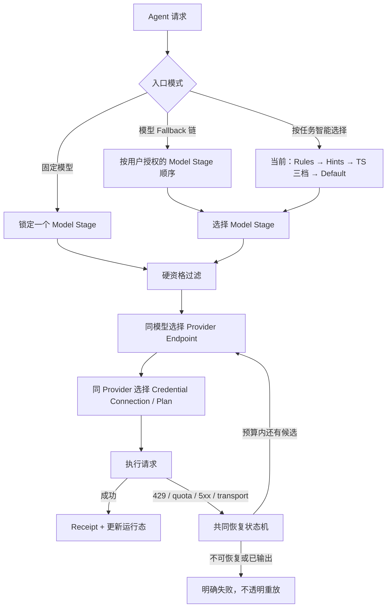

# token-station 多层路由架构专题调研

> 竞品参照：OmniRoute、OpenRouter、CC Switch  
> 研究日期：2026-07-27  
> token-station 基线：`test/manual-agent-regression-20260723` @ `d96ea4dbf3b74138d9fda5cd1b59ee9587e70445`，已合并 `origin/develop` @ `967d2a36ad76fa84b90a58dd0242d907786fe6f1`  
> OmniRoute 基线：`release/v3.8.49` @ `ed7db3ee5f89a144b2d931d8605534522f83de30`；最新正式版仍为 `v3.8.48`  
> 证据边界：token-station 结论来自合并后的本地源码与实际构建/测试；OmniRoute 结论来自固定提交源码；OpenRouter、CC Switch 结论来自当前官方文档与仓库。本文不把 OmniRoute 用户可能采用的账号来源归因于项目。
> 2026-07-28 复核：OmniRoute 开发源码补查至 `d6c06932ec9f27af140a43af030d2a77488e0863`；token-station 相关路径复核至 `fce85daca36e19a886189bf0fd6b3c37b9548558`。下文保留初始取证提交的 permalink，但产品结论按复核结果修正。

---

## 先说结论：token-station 应该学什么

token-station 不应该照搬 OmniRoute 的 19 个策略列表。应该学习的是下面五个更基础的结构。

1. **把 Pool 真正做成多 Candidate 资源池。** 核心 schema 已支持，先补 Desktop 编辑和展示。
2. **让“固定模型、模型 Fallback 链、按任务智能选择”三种入口并立。** TS 三档是第三种入口当前受控、可解释的实现；“用完再换”是 Plan 策略预设，不是第四套路由引擎。
3. **把模型、Provider、Plan 三个选择维度分层。** 每一层只回答一个问题，不把所有东西压成一个 Candidate 后再扔给 19 种算法。
4. **增加合规 Plan 的智能耗尽。** 只使用来源明确的 API Key/企业订阅和正式 quota 信号；优先消耗快重置、仍有余量的额度。
5. **所有模式共用一套恢复状态机。** 429、quota exhausted、5xx、401、400 和流式输出后的失败必须分别处理。

最小可落地形态不是 19 种策略，而是：

```text
模型选择
├─ 固定模型
├─ 模型 Fallback 链
└─ 按任务智能选择
   ├─ 当前：TS 三档
   └─ 远期：任意模型 Auto Router

池内 Provider 策略
├─ 健康优先 + 指定顺序（默认）
└─ 最低价 / 延迟 / 吞吐（P2）

Plan 策略
├─ 指定顺序（默认）
└─ 智能耗尽

恢复策略
├─ 严格：不离开当前池
└─ 有界：按显式顺序 fallback
```

优先级建议：

| 优先级 | 先做什么 | 为什么 |
|---|---|---|
| P1 | Desktop 支持每个 Pool 多 Candidate；提供“固定 / Fallback 链 / 智能选择”；显示真实备用数 | 核心已经支持多成员骨架，但 UI 与 Agent/Profile 配置仍压成单成员 |
| P1 | 保留并产品化现有 `Strict/Ordered` Recovery；补完整错误矩阵和回执 | 先把失败行为讲清楚，不能用“自动切换”掩盖错误 |
| P2 | 增加 `CredentialConnection`、`QuotaWindow` 与智能耗尽 | 才能表达跨 Plan、5h/7d 窗口和额度恢复 |
| P2 | 增加同模型 Provider 的价格、延迟、吞吐预设 | 借鉴 OpenRouter，但不阻塞第一版资源池 |
| P3 | 会话粘性、Prompt Cache 粘性、P2C、权重分摊 | 有运行数据后再做，避免先堆算法 |
| 不做 | Cookie 抓取、客户端伪装、账号农场、封禁规避、Fusion/Pipeline 混入路由核心 | 不符合 token-station 的可信本机网关定位 |

---

## 1. 先把“路由”拆成正确的拓扑

目前讨论会乱，是因为“路由”这个词同时指模型选择、Provider 分流、账号消耗和失败恢复。它们应该是四个独立问题。



四层分别回答：

| 层 | 只回答什么 | 典型策略 |
|---|---|---|
| 入口/模型层 | 这次任务允许用哪些模型？ | 固定模型、模型 fallback 链、智能三档 |
| Provider 层 | 同一个模型由哪个 Endpoint 提供？ | 稳定均衡、最低价格、最低延迟、最高吞吐、指定顺序 |
| Plan/Connection 层 | 同一 Provider 下用哪个授权凭据或套餐？ | 智能耗尽、顺序耗尽、余量优先、均衡分摊 |
| 恢复层 | 当前尝试失败后能否、向哪里切换？ | cooldown、breaker、有界 fallback、停止 |

“能力、隐私、地区、上下文、价格上限”不是新的路由模式，而是横切的硬资格过滤；“会话粘性、Prompt Cache”是排序修正；`fusion`、`pipeline` 是多模型编排，不应放进普通路由列表。

---

## 2. 三种入口必须并立

### 2.1 固定模型

适合明确知道要什么的用户：

```text
Claude Code → claude-sonnet
Codex       → gpt-codex
```

固定模型不等于固定 Provider。可以在不替换模型语义的前提下做同模型 Provider fallback：

```text
claude-sonnet
├─ Provider A
├─ Provider B
└─ Provider C
```

token-station 当前的 `honor_exact_model` 已经实现“不偷换模型”的核心语义，但路径会在共同 `rank` 之前提前返回：它只按健康状态排同名候选，当前不保证用户 Pool/Provider 顺序，也没有应用 `local_only` 和 Ordered Recovery。因此 exact + local-only 组合是提交路由扩展前应先修的 P0，不能写成已完整支持同模型 Provider 顺序。

CC Switch 适合作为“配置和手动切换体验”的参考，但不能再把它简单等同于只有固定切换。当前官方 README 已宣称本地代理、热切换、auto-failover、circuit breaker 和健康监测。对 token-station 最值得借的是 Agent 配置生命周期和低心智入口，不是把它当完整路由算法标杆。

参考：[CC Switch 官方 README](https://github.com/farion1231/cc-switch#proxy--failover)

### 2.2 模型 Fallback 链（“直接资源池”可作快捷预设）

这是不使用高/中/低分类时的明确入口：

> 不做高中低判断；用户明确把若干资源放进一个池，系统按指定规则使用，失败或额度耗尽后换下一个。

```text
Pool: coding-plans

Stage 1: Claude Sonnet
  ├─ Anthropic 企业 Key A
  └─ Anthropic 企业 Key B

Stage 2: GPT Coding
  └─ OpenAI 项目 Key C

Stage 3: Gemini Pro
  └─ Google 项目 Key D
```

对“我不要三档，我只想把手里的 Plan 用完”，不需要再造一种路由模式：固定一个模型或配置模型 Fallback 链，再把 Plan 策略设成顺序/智能耗尽即可。“直接资源池”可保留为一键生成这组配置的 UI 预设，但不是第四套底层语义。

第一版不需要增加新的数据面分支：单模型可复用 exact/Pool 语义；不同模型必须编译为一个 Pool 对应一个 Model Stage，再用 Ordered Recovery 串起来。不能把有顺序的不同模型压进一个扁平 Pool，否则健康排序可能让后面的 Healthy 模型跳过前面的 Degraded 模型。

如果池内放了不同模型，必须由用户显式接受模型替换，或者把它们放进有顺序的 `ModelStage`；系统不能默认认为不同模型完全等价。

### 2.3 智能三档

这是 token-station 的特色，解决的是任务难度和能力选择：

```text
高档：复杂推理、长上下文、关键编码
中档：普通编码和通用任务
低档：摘要、改写、简单问答
```

最新代码已经不是简单二档阈值：`heuristic.bands` 支持多档；决策顺序是 Rules → Agent Hints → Heuristic → Default。2026-07-24 的修复主要排除了固定 system token 体量和广告的工具清单，但 `message_count`、代码块和 `system_format_hint` 仍可参与特征；不能概括为“整个系统 Prompt 都不影响评分”。

三档只负责“选质量池”，不负责“如何耗额度”。因此每一档内部都可以再选择：

```text
高档 Pool
├─ Provider 策略：稳定均衡
├─ Plan 策略：智能耗尽
└─ Recovery：严格留在高档，或显式去中档
```

---

## 3. token-station 最新实现：已经有什么、真正缺什么

### 3.1 已经具备的骨架

合并最新 `origin/develop` 后，本地源码确认：

- `RouterConfig.pools` 已是 `Pool → Vec<UpstreamModel>`，核心允许每池多个 Candidate；
- `heuristic.bands` 已支持高/中/低多档，而非只能二分；
- `RecoveryPolicy` 已有 `Strict` 与显式 `Ordered { pools }`；
- exact model 模式已支持同名模型跨 Provider fallback，但它绕过公共 rank，当前不应视为完整支持 Pool 顺序、`local_only` 与 Ordered Recovery；
- 普通 Pool 路径的 Candidate 已做 tools、vision、JSON Schema、context window、local-only 和健康过滤；
- 同健康等级内稳定保留操作者写入顺序；
- Gateway 已有 attempt 次数、总 deadline、per-attempt timeout、`Retry-After`、首字节前 fallback 边界和无正文 attempt receipt；`AttemptBudget` 虽已预留可选 cost 字段，但当前生产路径仍设为 `None`，不能宣称成本预算已经启用；
- 健康状态以 `(upstream, model)` 为粒度，一个模型坏掉不会摘除同站其他模型。

关键源码：

- [路由配置与 RecoveryPolicy](../../crates/router-core/src/config.rs)
- [选池、过滤、排序与 exact model](../../crates/router-core/src/route.rs)
- [路由回归测试](../../crates/router-core/tests/routing.rs)
- [Gateway attempt budget 与 fallback](../../apps/cli/src/gateway.rs)

### 3.2 当前产品缺口

真正的缺口集中在 Desktop 和 Connection 数据模型：

1. Desktop 的 `set_tier_value` 每次都把一个档写成只有一个元素的数组；核心虽支持多成员，UI 没有暴露。
2. Desktop 的 `pool_member`、`BandView`、`PoolView` 只展示第一个成员，用户看不到完整备用链。
3. 没有完整的“固定 / 模型 Fallback 链 / 智能选择”产品入口；用户也看不到编译后的真实尝试顺序。
4. Candidate 的身份维度只到 `upstream + model`（对象本身还带 capability、health 和 local 状态），没有 `credential_connection_id`、多重 quota claims、余额与 reset 时间。
5. Pool 内只按健康、然后按配置顺序；没有价格、延迟、吞吐和 Plan 消耗策略。
6. 当前 `RecoveryPolicy` 只有 Strict/Ordered；这已经够第一版使用，不需要立刻扩成 OmniRoute 的 19 种。

因此下一步不应“重写 Router”，而应：

```text
先把 Desktop、Agent route 与 Profile 的单成员限制拆掉
→ 再加入模型 Fallback 链和执行预览
→ 再把 Credential Connection 与多重 QuotaClaim 绑定到完整尝试目标
→ 最后才增加运行态排序
```

---

## 4. OmniRoute：值得学的是能力，不是 19 个名称

OmniRoute 普通用户不必配置 19 种策略。可以直接请求：

```text
auto
auto/coding
auto/fast
auto/cheap
auto/offline
auto/smart
```

高级用户才创建 Combo，并为候选链选择主要策略。固定源码公开 19 个策略，另有内部 `quota-share`；Connection/账号层又有 9 个 fallback 策略。

19 个名称实际混合了五类概念：

| 真正类别 | OmniRoute 名称 | token-station 如何吸收 |
|---|---|---|
| 顺序消耗 | `priority`、`fill-first` | 合并成“指定顺序/顺序耗尽” |
| 负载均衡 | `weighted`、`round-robin`、`p2c`、`least-used`、`random`、`strict-random` | 第一版只做稳定均衡；其余后置 |
| 优化目标 | `cost-optimized`、`headroom`、`reset-aware`、`reset-window` | 分别归 Provider 策略或 Plan 策略 |
| 粘性/上下文 | `lkgp`、`cache-optimized`、`context-optimized`、`context-relay` | 做横切修正，不做主入口 |
| 自动与编排 | `auto`、`fusion`、`pipeline` | `auto` 对应智能入口；Fusion/Pipeline 独立产品线 |

OmniRoute 的灵活来自把 `Provider + Connection + Model + Plan` 压平为 Candidate，再用策略排序。这样能快速组合异质资源，但用户很难判断策略到底在选模型、选 Provider，还是耗账号。token-station 应保留这些能力的表达力，却把它们放回正确层级。

参考：

- [OmniRoute 19 个公开策略源码](https://github.com/diegosouzapw/OmniRoute/blob/ed7db3ee5f89a144b2d931d8605534522f83de30/src/shared/constants/routingStrategies.ts)
- [OmniRoute README 的 Combo 与策略说明](https://github.com/diegosouzapw/OmniRoute/blob/ed7db3ee5f89a144b2d931d8605534522f83de30/README.md#L238-L337)

---

## 5. OpenRouter：最值得借的是分层和渐进式配置

OpenRouter 的基本顺序比 OmniRoute 清楚：

```text
选择模型
→ 同模型选择 Provider Endpoint
→ 当前 Provider 失败后换同模型 Provider
→ 当前模型全部失败后，才进入下一个 fallback 模型
```

当前官方 Provider Routing 支持：

- 默认：先避开短期故障 Provider，再在低价候选中按价格反平方加权负载均衡；
- `sort=price|throughput|latency`；
- `order` 指定 Provider 顺序；
- `only`、`ignore`、`max_price`、ZDR、数据收集、参数支持、量化等过滤；
- 多模型时默认 `partition=model`，先保持模型优先级；`partition=none` 才允许跨模型全局按性能排序；
- `models` 数组表达模型 fallback 链。

这说明“不同模型 + 不同 Provider”不需要变成一张无结构的表。先按 Model Stage 分区，Stage 内再选 Provider；只有高级用户明确选择全局性能优先，才拆掉模型分区。

OpenRouter 的配置界面也采用渐进披露：普通用户使用默认路由或 Auto Router；高级用户把模型、模型 fallback、Provider 偏好和过滤条件保存成命名 Preset。token-station 应借这个产品结构，而不是把所有下拉框同时铺在首页。

OpenRouter Auto Beta 与 token-station 三档相近但不相同：它先把 Prompt 分类为约 30 个任务类型，再按该任务过去 7 天的社区 spend share 排模型，并应用 0–10 的 cost/quality dial；token-station 当前是完全本地、可重放的 Rules/Hint/整数启发式。TS 不应为了模仿它而上传 Prompt 或依赖云端群体数据。

参考：

- [OpenRouter Provider Routing](https://openrouter.ai/docs/guides/routing/provider-selection)
- [OpenRouter Model Fallbacks](https://openrouter.ai/docs/guides/routing/model-fallbacks)
- [OpenRouter Presets](https://openrouter.ai/docs/guides/features/presets)
- [OpenRouter Auto Router](https://openrouter.ai/docs/guides/routing/routers/auto-router)

---

## 6. “五小时额度”和智能耗尽到底怎样工作

### 6.1 五小时不是 token-station 自定的统计周期

OmniRoute 对 Codex 类连接会标准化两类窗口：

```text
session / 5h
weekly / 7d
```

每个窗口至少需要：

```text
remainingPercentage
resetAt
observedAt
windowName
```

它读取 quota 状态，判断某个窗口是否达到阈值；达到阈值后把连接阻塞到对应 `resetAt`。所以“统计耗光”的本质不是 OmniRoute 自己从零准确计算五小时额度，而是尽量读取或缓存上游暴露的用量/重置状态，再把它变成连接资格和排序输入。但这些信号的来源并不统一：有正式 Usage API/标准响应头，也有非官方 Web/OAuth 端点与本地估算。因此不能把所有 `5h/7d` 数字都当成可验证的 Provider 计费真相。

参考：[OmniRoute Codex quota window 与连接资格逻辑](https://github.com/diegosouzapw/OmniRoute/blob/ed7db3ee5f89a144b2d931d8605534522f83de30/src/sse/services/auth.ts#L240-L580)

### 6.2 “耗光”对应哪种策略

几个容易混淆的策略目标：

| 目标 | 含义 |
|---|---|
| 顺序耗尽 | 固定用 A，A 不可用或耗尽后才用 B |
| 余量优先 | 谁剩得多用谁，重点是避免 429，不保证利用即将重置的旧额度 |
| 重置优先 | 谁更快重置先用谁，但只看 reset 时间仍不够 |
| 智能耗尽 | 同时看剩余额度、距重置时间、请求预计消耗、保留量和粘性 |

用户提出的例子是智能耗尽：

```text
Plan A：刚重置，剩余 100%，5 小时后重置
Plan B：剩余 50%，10 分钟后重置
```

如果当前请求两个 Plan 都能满足，应该先用 B。否则十分钟后 B 的 50% 被重置掉，而 A 的额度还有五小时可以慢慢使用。

假设两个 Plan 的容量可比较，一个用于解释直觉的 token-station 候选指标是：

```text
expiry_pressure = usable_remaining / max(minutes_to_reset, 1)
```

在例子里：

```text
A = 1.00 / 300 = 0.0033
B = 0.50 / 10  = 0.0500
```

B 的“必须尽快消耗压力”更高，因此在这个只有一个可比窗口的简化例子中先用 B。这个公式是 TS 的设计提案，不是 OmniRoute 的实际评分公式；真实请求还必须同时保护组织 RPM、项目 TPM、模型族周额度和预算等全部约束。

但不能只靠一个浮点总分。推荐使用可审计的字典序：

1. 硬能力、模型/档位、隐私、地区、预算过滤；
2. 排除 disabled、401 隔离、breaker、quota exhausted；
3. 优先官方 quota 信号新鲜且能覆盖预计请求的连接；
4. 按 expiry pressure 或最早 reset 排序；
5. 用 `min_dwell`、session stickiness 和 hysteresis 防止每次请求来回抖动；
6. 分数相同时使用用户顺序，保证可重放。

额度状态缺失或过期时，必须标为 `unknown`，退回指定顺序/健康排序；不能伪装成“智能耗尽已生效”。

### 6.3 不同供应商、不同模型能否都耗完

可以，但这不是默认安全行为，必须经过用户显式建模：

```text
模型 Fallback 链
├─ Stage 1：Claude Sonnet（多个 Provider/Plan）
├─ Stage 2：GPT Coding（多个 Provider/Plan）
└─ Stage 3：Gemini Pro（多个 Provider/Plan）
```

系统先在 Stage 1 内智能耗尽；Stage 1 全部不可用后，Recovery 明确允许才进入 Stage 2。OpenRouter 的 `partition=none` 证明“跨模型全局排序”在技术上可表达，但它会取消模型优先级；TS 首版不应提供这个默认/普通开关。只有未来高级用户明确建立模型等价或替代授权时，才可考虑跨 Stage 全局优化。

---

## 7. 推荐的数据模型

```text
RouteProfile
├─ model_mode: exact | fallback_chain | task_aware
├─ tiers: high / mid / low → PoolRef
├─ model_stages[]
├─ hard_constraints
└─ recovery_policy

Pool
├─ model_stages[]
├─ provider_policy
├─ plan_policy
└─ session_policy

ModelStage
├─ model / model_family / explicit_equivalence_group
└─ candidates[]

Candidate
├─ provider_endpoint_id
├─ credential_connection_id
├─ wire_model
├─ capability_snapshot
└─ quota_claims[]

CredentialConnection
├─ secret_ref
├─ owner / purpose / project / budget_scope
├─ authorized_source
└─ quota_domain_refs[]

QuotaDomain
├─ scope: organization / project / model_family / spend
└─ windows[]

QuotaWindow
├─ kind: 5h / 7d / rpm / tpm / monthly / custom
├─ remaining / capacity / unit
├─ reset_at / observed_at
└─ evidence_source: official_api | standard_header | admin_config
```

这里最重要的是 `quota_claims[]`，而不是单个 `quota_domain_id`。一个请求可能同时消耗组织 RPM、项目 TPM、模型族周额度与支出预算；同一 QuotaDomain 也可被多个 Connection 共享。所有 claim 必须同时满足，否则路由器会高估容量，并在 429 后无意义换 Key。

---

## 8. 推荐的具体界面

### 8.1 首页只出现三种模式

```text
路由方式

○ 固定模型
  始终保持模型语义，可在同模型 Provider 间故障切换

○ 模型 Fallback 链
  不分高中低，按明确授权的模型顺序尝试

● 按任务智能选择（推荐）
  当前使用 TS 高/中/低三档，每档内部再管理 Provider 与 Plan
```

### 8.2 Pool 编辑器只显示关键结构

```text
Pool: 中档编码

模型阶段 1  Claude Sonnet
  Anthropic / 企业 Key A   剩余 35%   12 分钟重置
  OpenRouter / BYOK        价格较低   健康

模型阶段 2  GPT Coding
  OpenAI / 项目 Key C      剩余 90%   4 小时重置

Provider：稳定均衡
Plan：智能耗尽
失败：先同模型，再进入下一模型阶段
```

### 8.3 高级项折叠

高级抽屉才展示：

- Provider：最低价格、最低延迟、最高吞吐、指定顺序；
- Plan：顺序耗尽、余量优先、均衡分摊；
- 模型分区：首版始终保持 Model Stage；跨模型全局排序不进入普通 UI；
- session stickiness、min dwell、reserve；
- `max_attempts`、`max_elapsed`、`max_cost`。

这样普通用户只面对三种入口和两个默认策略，不会看到 OmniRoute 式 19 项平铺；高级用户仍能表达相同的大部分能力。

---

## 9. 429 与错误恢复矩阵

选择策略和恢复策略必须分开。下面的矩阵应该成为代码与 UI 的共同事实源。

| 结果 | 状态更新 | 是否切换 | 说明 |
|---|---|---|---|
| 429 + `Retry-After` | 作用域未知时只冷却当前 connection/model 请求类；只有权威结构化证据才更新 QuotaDomain | 是，预算内换下一个 | `Retry-After` 说明时间，不能单独证明限额实体；不应把整个 Provider 判死 |
| 明确 `quota_exhausted` + `resetAt` | 该窗口阻塞到 reset | 是 | reset 后重新入池 |
| 临时 5xx/连接失败 | `(endpoint, model)` 失败计数与 breaker | 是，预算内 | 多次失败才摘除，HalfOpen 单探针 |
| 401/无效 Key | 隔离 credential 并告警 | 可以换一次授权备用，但不能无限轮换掩盖 | 需要人工处理 |
| 账号禁用/合规拒绝 | 终止该 connection | 默认停止或显式受控 fallback | 不能视为普通限流 |
| 400/参数不支持 | 重新做能力判断或明确失败 | 默认不盲目换 Key | 同一请求换 Key 通常无意义 |
| 已向客户端输出 token 后失败 | 记录 partial failure | 不透明重放 | 防重复工具调用和双重计费 |
| 本地 attempt 次数或 elapsed 预算耗尽 | 停止 | 否 | 防候选多时无限瀑布；cost budget 待生产路径接线后再加入 |

每次选择和切换的 Receipt 至少记录：

```text
profile_id / pool_id / model_stage_id
provider_endpoint_id / credential_connection_id（非秘密 ID）
selection_policy / recovery_policy
quota evidence source / observed_at / reset_at
排除原因 / 切换原因 / cooldown_until
attempt 序号 / 是否 fallback / 最终服务者
```

继续不记录 Key、Prompt、Response 或原始 Cookie。

---

## 10. 实施 Roadmap

### Phase 1：把现有 Pool 做完整（P1）

- Desktop 一个档允许添加、排序、删除多个 Candidate；
- `BandView`/`PoolView` 返回完整成员，不只取第一个；
- 新增“固定模型 / 模型 Fallback 链 / 按任务智能选择”入口；“用完再换”只作 Plan 预设；
- UI 明示“当前池备用 N 个”和 `Strict/Ordered`；
- 路由预览展示：选中哪个池、硬过滤排除了谁、fallback 顺序是什么；
- 先修正 exact-model 对 `local_only`、Pool/Provider 顺序和 Ordered Recovery 的绕过，并补组合测试。

验收：一个池 3 个 Candidate，首选 429 时能在首字节前按预算切到第二个；Strict 不跨池，Ordered 只按明确配置跨池；Desktop 与 CLI 读写同一结构。

### Phase 2：增加 Connection 与智能耗尽（P2）

- 引入 `CredentialConnection`、`QuotaDomain` 与 `quota_claims[]` 多对多约束图；
- Secret 仍由现有 SecretSource/OS Keychain 托管，配置只保存引用；
- 支持正式 Usage API、标准 rate-limit header、管理员静态窗口；
- 实现 `ordered`、`smart_exhaust` 两个 Plan 策略；
- Receipt 加入非秘密 credential ID 与 quota evidence；
- 401、quota exhausted、429 分开建模。

验收：A=100%/5h、B=50%/10m 时选择 B；B reset 后重新入池；quota unknown 时明确降级为 ordered；共享 quota domain 的两个 Key 不被重复计算容量。

### Phase 3：运行态 Provider 优化（P2/P3）

- 增加 price、latency、throughput 三个 Provider 预设；
- 指标必须有 provenance、样本窗口和 freshness；
- 增加 session/cache stickiness 与 hysteresis；
- 有足够流量后再考虑 weighted、P2C、least-used。

验收：策略每次选择都能解释，历史配置和相同快照可重放；指标过期时不继续宣称“最快/最便宜”。

### 明确不进入这条 Roadmap

- OAuth/Web Cookie 抓取；
- 模拟官方浏览器或客户端身份；
- 来源不明账号池、账号农场和封禁规避；
- 内部/网页额度接口作为企业级事实源；
- Fusion、Pipeline、Context Relay、MCP/A2A、Memory 与媒体 Agent；
- 为了“功能数量”复制 19 个策略名称。

---

## 11. 本轮合并与验证

本轮先在当前仓库执行 `git fetch --prune origin`，再把 `origin/develop` 的 21 个新提交合并进当前 `test/manual-agent-regression-20260723` 分支。合并提交为 `d96ea4d`，无冲突；原有本地测试提交和未跟踪材料均保留，没有创建第二份源码目录，也没有 push。

验证结果：

| 检查 | 结果 |
|---|---|
| `cargo build --workspace` | 通过 |
| `cargo build --manifest-path apps/desktop/src-tauri/Cargo.toml` | 通过 |
| `npm --prefix apps/desktop run build` | 通过；Vite 仅提示主 chunk 超过 500 kB |
| `cargo test -p token-station-router-core` | 50 个单元测试 + 23 个路由集成测试通过 |
| `npm --prefix apps/desktop test -- --run` | 20 个文件、158 个测试通过 |

依赖安装阶段还有一个非阻断环境警告：本机 Node 为 `22.14.0`，间接依赖 `@lobehub/ui` 声明需要 `>=22.22.0`；本轮 TypeScript/Vite 编译与 Vitest 均实际通过。正式 CI 应继续使用仓库工作流固定的 Node `22.23.1`。

---

## 12. 最终判断

token-station 现在不是缺一套新的路由内核，而是缺把已有内核产品化的中间层。

最合理的终局是：

```text
CC Switch 式低心智接入与手动控制
        +
OpenRouter 式“模型 → 同模型 Provider → 模型 fallback”分层
        +
OmniRoute 式 Plan/quota window 感知，但只接受合规凭据与正式信号
        +
token-station 自己的本地三档、确定性、首字节边界和无正文 Receipt
```

因此产品上不应该让用户先学习 19 种算法。首页只给：**固定模型、模型 Fallback 链、按任务智能选择（当前为 TS 三档）**。每个 Model Stage 内再按 Provider 和 Plan 两个轴展开，全部模式共用硬资格过滤、粘性、429 冷却、熔断和有界 Fallback。

这既能支持“我不要高中低，只想耗尽手里所有 Plan”，也能支持“高档内部先智能耗尽多个 Plan，429 后有界切换”，同时保留 token-station 最重要的差异化：可解释、可审计、默认安全，而且不会为了提高可用性偷偷改变用户没有授权的模型和信任边界。
