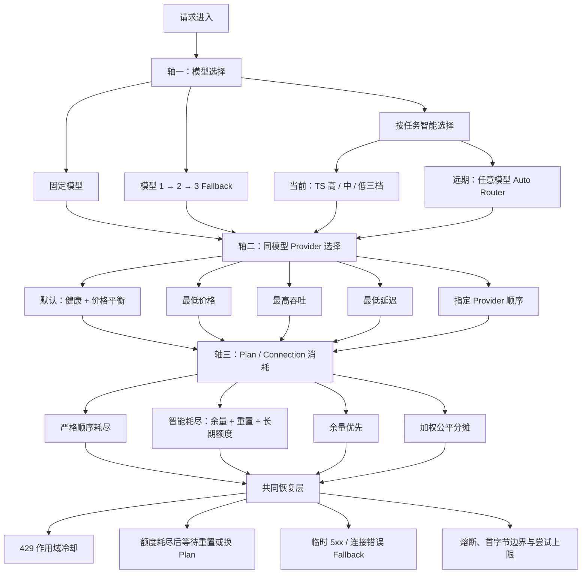

# token-station 路由竞品借鉴收口结论

> 研究日期：2026-07-27 至 2026-07-28
>
> 竞品参照：OpenRouter、OmniRoute、CC Switch、Cursor Router
>
> token-station 提交基线：`origin/develop` @ `7d5bf8aaa14b8467fb94e95d3e55a6b45cc33e1c`
>
> 证据边界：结论来自 token-station 本地源码和测试、OmniRoute 固定源码、OpenRouter/CC Switch 官方文档与仓库。源码能证明 OmniRoute 支持多 Connection、OAuth/Web session、额度读取、冷却和换号；不能证明账号通过日抛号、假信用卡等方式获得。

## 0. 先说最简单的：TS 应该学什么

一句话：

> 学 OpenRouter 的分层，学 OmniRoute 的合规 Plan/额度感知，学 CC Switch 的低心智主备界面，学 Cursor 的任务效果验证；不照搬 19 种平级策略，不做来源不明的账号池。

具体只学五件事：

1. **三轴分层**：模型选择、同模型 Provider 选择、Plan/Connection 消耗分开配置。
2. **真正的多成员 Pool**：用户看得到主模型、备用模型、Provider 和 Plan 的实际顺序。
3. **合规的多 Credential**：只管理来源明确、组织授权的 API Key/企业 Plan，支持顺序和智能耗尽。
4. **共同恢复层**：429、quota exhausted、5xx、401 和流式中断分别处理，且有次数、时间、成本和已输出边界。
5. **可解释与验证**：界面显示编译后的尝试顺序，Receipt 记录选择和切换原因，任务路由使用脱敏评测验证。

最小落地形态：

```text
模型：固定 / Fallback 链 / 按任务智能选择（当前为 TS 三档）
Provider：健康优先 + 按列表兜底
Plan：按列表耗尽
恢复：仅在明确可恢复错误且未提交输出时切换
审计：只记非秘密 ID、候选、排除原因、attempt 和 cooldown
```

明确不学：

- OAuth/Web Cookie 抓取和非官方网页端点；
- 客户端身份模拟、账号农场、封禁规避和无限换号；
- 把不同模型默认压平后全局排序；
- 把 `fusion`/`pipeline` 多模型编排混入普通路由菜单；
- 把未知额度当作 100% 可用。

## 1. 最终产品结构



两个容易混淆的名字：

- **模型 Fallback 链**：用户授权哪些模型可以替代，以及顺序。
- **有界 Fallback**：运行时哪些错误可继续、最多尝试几次、超过什么边界必须停止。

## 2. 各家只借哪一部分

| 竞品 | 值得学 | 在 TS 中怎样落地 | 不照搬 |
|---|---|---|---|
| OpenRouter | `model/models` 与 `provider` 分层；同模型按价格、延迟、吞吐或顺序选 Endpoint；Preset 和 Router Metadata | Model Stage 始终保留模型边界；Provider 策略作为第二轴；显示编译后尝试链 | 默认 `partition:none`；任何错误都跨模型 Fallback |
| OmniRoute | 多 Connection、quota window、顺序/重置/余量策略、Connection cooldown | 只在同一合规 Provider 下引入 Credential Connection；用 `quota_claims[]` 表达组织、项目、模型族等多重约束 | 19 项平铺；Web Cookie、非官方端点、身份模拟和来源不明账号池 |
| CC Switch | 明确的 P1/P2/P3 队列、一键接管、熔断和半开探测 | Provider 指定顺序、主备数和失败后去向都可见 | 把配置切换当成完整模型路由 |
| Cursor Router | 用真实任务成功率、成本和回归验证自动选模型 | TS 三档先保持本地可解释规则，再用脱敏 paired/shadow eval 验证档位选择 | 隐藏实际模型、不可审计的云端黑盒分流 |

OpenRouter 的默认 `partition:model` 证明：多模型 Fallback 时应先保持模型顺序，再在每个模型内选 Provider。OmniRoute 的 19 个名称则应被还原到模型、Provider、Plan、粘性/恢复和编排不同层级，而不是加入同一个下拉框。

## 3. TS 当前有什么、缺什么

已有骨架：

- `RouterConfig.pools` 已是多成员 `Vec<UpstreamModel>`；
- Rules → Hints → Heuristic bands → Default 已能表达 TS 三档；
- `RecoveryPolicy` 已有 `Strict` 和显式 `Ordered`；
- Gateway 已有 attempt 数、deadline、`Retry-After` 等有界恢复骨架；
- Receipt/attempt 默认不记录 Key、Prompt 和 Response 正文。

当前缺口：

- Desktop、Agent route 和 Profile 仍把每档压成一个 `(upstream, model)`；
- `honor_exact_model` 绕过公共 rank，当前未正确继承 `local_only`、Pool 顺序和 Ordered Recovery；
- 流式提交边界还需区分真实内容/工具调用与 Usage、Done、空 Chunk；
- 没有 Credential Connection、QuotaDomain 和多重 `quota_claims[]`；
- 没有可靠的运行态价格、延迟、吞吐排序与中央公平调度。

## 4. 最小 Roadmap

### P0：先修正语义

- exact model 必须遵守 `local_only`、允许的 Pool/Provider 顺序和 Recovery；
- 只有首个有效内容、reasoning 或 tool call 才进入不可透明重放的 committed 状态；
- 补 exact + local-only、空流事件、已输出后失败的组合测试。

### P1：把已有路由骨架产品化

- 首页只给“固定模型 / 模型 Fallback 链 / 按任务智能选择”；
- Desktop、Agent 与 Profile 都支持多成员池；
- 同模型 Provider 首版只做“健康优先，按列表兜底”和“指定顺序”；
- UI 展示人话执行预览、备用数、排除原因和实际服务者。

### P2：加入合规 Plan 层

- `Provider → Credential Connection ↔ QuotaDomain → Windows`，一个请求携带多个必须同时满足的 `quota_claims[]`；
- 先做顺序耗尽，再做只使用新鲜、正式额度信号的智能耗尽；
- 额度未知时可见降级为静态顺序，不伪装为智能选择。

### P3：有数据后再做优化

- 最低价格、最低延迟、最高吞吐；
- session/prompt-cache 粘性；
- 余量优先、加权公平分摊、P2C/DRR 等内部调度；
- 任务效果评测和可回滚的模型/profile 升级。

## 5. 三个典型组合

### 不要三档，只想耗尽多个 Plan

```text
模型：固定 Claude Sonnet
Provider：指定顺序
Plan：顺序耗尽
```

### 高档里有多个 Plan，遇到 429 仍保持高档

```text
模型：按任务智能选择 → 高档
Provider：同模型健康优先
Plan：智能耗尽
恢复：先换 Plan，再换同模型 Provider，全部不可用才按授权进下一 Model Stage
```

### 主模型失败后换另一模型

```text
模型：Claude Sonnet → GPT Coding → Gemini Pro
Provider：每个模型内部指定顺序
Plan：顺序耗尽
恢复：完成当前 Model Stage 的合法尝试后才进下一模型
```

## 6. 核心证据

- [OpenRouter Provider Selection](https://openrouter.ai/docs/guides/routing/provider-selection)
- [OpenRouter Model Fallbacks](https://openrouter.ai/docs/guides/routing/model-fallbacks)
- [OpenRouter Presets](https://openrouter.ai/docs/guides/features/presets)
- [OpenRouter Router Metadata](https://openrouter.ai/docs/guides/features/router-metadata)
- [OmniRoute 公开路由策略定义](https://github.com/diegosouzapw/OmniRoute/blob/d6c06932ec9f27af140a43af030d2a77488e0863/src/shared/constants/routingStrategies.ts)
- [OmniRoute quota scoring](https://github.com/diegosouzapw/OmniRoute/blob/d6c06932ec9f27af140a43af030d2a77488e0863/open-sse/services/combo/quotaScoring.ts)
- [CC Switch Provider Router](https://github.com/farion1231/cc-switch/blob/f6e37ed99443890a865669e28bf1caf5e85d466d/src-tauri/src/proxy/provider_router.rs)
- [token-station RouterConfig](../../crates/router-core/src/config.rs)
- [token-station 路由选择](../../crates/router-core/src/route.rs)
- [token-station Gateway 恢复](../../apps/cli/src/gateway.rs)

## 7. 最终判断

token-station 不需要变成 OmniRoute。最合理的终局是：

```text
CC Switch 式低心智入口
+ OpenRouter 式模型 / Provider 分层
+ OmniRoute 式合规 Plan 与 quota window 感知
+ Cursor 式任务效果验证
+ TS 自己的本地三档、确定性、可解释和无正文 Receipt
```

对普通用户，界面只需要三个模型入口和两个默认策略；复杂的加权、P2C、DRR、quota window 评分和状态机留在内部。这样既能表达“用完再换”、同模型 Provider 容灾和三档智能路由，又不会让用户面对 19 种概念不一致的选项。
