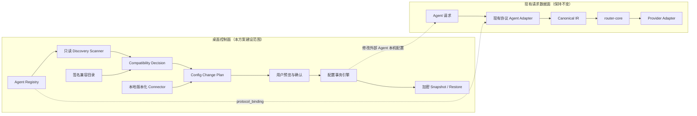

# Token Station Agent 自动发现、版本兼容与安全接入正式方案

> 日期：2026-07-20
> 版本：v1.0
> 状态：用户已整体确认
> 性质：正式设计方案，不是业务代码实施授权

## 1. 执行摘要

本方案解决四个直接问题：

1. Claude Code、OpenCode、Codex 等 Agent 升级后，Token Station 能识别实际版本并采取正确的兼容、警告或阻断动作；
2. 新增 OpenClaw、Hermes 等 Agent 时，不再在前后端多处复制硬编码分支；
3. 修改外部 Agent 配置前可预览、可确认、可恢复，不覆盖用户的未知配置；
4. 所有能力都建设在核心路由之外，`crates/router-core/**` 保持完全不变。

正式方案采用以下组合：

- **声明式 Agent Registry**：集中描述 Agent 身份、发现规则、配置位置、协议绑定和本地 Connector；
- **只读 Discovery Scanner**：自动发现可执行文件、版本、运行环境、损坏安装和多版本冲突；
- **双层版本兼容体系**：签名兼容目录热更新判断数据，版本化 Connector 代码随应用版本发布；
- **配置事务引擎**：加密快照、差异预览、用户确认、原子写入、写后验证和失败恢复；
- **协议复用**：新 Agent 优先复用现有 `agent-anthropic`、`agent-openai-responses`、`agent-openai`；
- **CI 红线门禁**：本专项任何提交触碰 `crates/router-core/**` 都必须失败。

产品策略保持极简：首期只提供自动发现、状态判断、连接、断开、恢复和重新扫描，不加入项目包、Skill/MCP 组合切换、自动安装第三方 CLI 等扩展功能。

## 2. 会议要求与方案响应

本方案基于《智能纪要：模型路由产品开发相关事项讨论 2026年7月17日》整理。会议纪要由 AI 生成，方案仅把其中可核验、已由用户确认的要求转化为设计约束。

| 会议要求 | 本方案响应 | 当前处置 |
|---|---|---|
| OpenCode 大版本升级可能改变配置规则 | 自动发现版本、配置格式指纹、版本兼容目录、未知版本保护 | 本方案阶段 1 |
| 配置同步前校验版本，只覆盖可识别配置段 | `CompatibilityDecision` 决定是否允许生成写入计划 | 本方案阶段 1 |
| 修改配置前备份并可回退 | 版本化加密快照、差异确认、失败自动恢复、用户主动恢复 | 本方案阶段 1 |
| 增加更多 Agent | Agent Registry；阶段 2 接入 OpenClaw、Hermes | 本方案阶段 2 |
| 参考 cc-Switch，但避免复杂化 | 借鉴检测机制，不照搬封闭枚举、分散硬编码和项目配置堆叠 | 已纳入架构决策 |
| 核心引擎与用户层分离 | 发现、配置和 UI 位于桌面控制面；请求数据面与 Router 不变 | 强制架构边界 |
| WASM 插件无侵入扩展 | 继续按协议复用 WASM Agent Adapter；需要文件访问的 Connector 留在受控宿主侧 | 强制架构边界 |
| 单元测试覆盖率不低于 80% | Rust 与前端分别统计，项目有效源码行覆盖率达到 80% 后才允许发布 | 验收门槛 |
| 多客户端映射多套路由策略 | 仅做核心外部的 Profile 方案论证，另行授权 | 后续专项 |
| 服务商断连自动故障转移 | 涉及路由/失败语义，另行完成证据和设计评审，当前不实施 | 后续专项 |
| 视频模型异步调用、企业版能力 | 不与本次 Agent 兼容工程混合 | 延后专项 |

## 3. 当前实现基线

### 3.1 已有能力

当前桌面 App 已支持手动接入三类 Agent：

| Agent | 当前配置文件 | 当前协议 | 当前 Adapter |
|---|---|---|---|
| Claude Code | `~/.claude/settings.json` | Anthropic Messages | `agent-anthropic` |
| Codex | `~/.codex/config.toml` | OpenAI Responses | `agent-openai-responses` |
| OpenCode | `~/.config/opencode/opencode.json` | OpenAI Chat Completions | `agent-openai` |

事实锚点：

- 前端 Agent 按钮仍是静态 `AGENTS` 数组：[`apps/desktop/src/App.tsx`](../../../apps/desktop/src/App.tsx)；
- IPC 类型仍是静态联合类型：[`apps/desktop/src/api.ts`](../../../apps/desktop/src/api.ts)；
- Tauri 后端通过 `match kind.as_str()` 静态分派：[`apps/desktop/src-tauri/src/lib.rs`](../../../apps/desktop/src-tauri/src/lib.rs)；
- 当前配置写入会先创建一个固定 `.token-station.bak`，再以同目录临时文件和 `rename` 替换；
- 当前协议 Adapter 已按协议复用，请求仍经过既有 Server、Gateway、Canonical IR、Router 和 Provider Adapter。

完整现状见[`桌面 App 接入 Agents 的实现机制`](../../contributing/桌面App-Agent接入机制.md)。

### 3.2 当前缺口

当前实现尚不具备：

- Agent 可执行文件和版本的自动发现；
- 多安装实例、损坏安装和版本冲突识别；
- 已验证、未知、阻断版本的统一兼容状态；
- 配置变更预览与用户二次确认；
- 防止预览后外部并发修改的哈希校验；
- 多版本快照、快照加密、写后自检和失败自动恢复；
- App 内断开和恢复入口；
- Registry 驱动的动态 Agent UI；
- OpenClaw、Hermes 的桌面 Connector；
- 本专项对 `router-core` 的机器化变更门禁。

这些缺口都属于桌面控制面和兼容基础设施，不要求修改核心路由。

## 4. 最高级红线与授权边界

### 4.1 绝对禁止修改

本方案不授权修改 `crates/router-core/**`，包括但不限于：

- 路由算法和任务分类；
- 规则匹配、评分、选池、排序和 fallback 语义；
- `RouterConfig`、`Decision` 及其核心契约；
- 为某个 Agent、供应商或版本增加路由特判。

任何后续实现 PR 只要触碰该目录，本专项 CI 必须失败并禁止合并。

### 4.2 本方案允许设计、但仍需实施授权的外围范围

- `apps/desktop/**` 中的 Agent 控制面、动态 UI 和 Tauri IPC；
- 新的本机 Agent Registry、Discovery Scanner、Connector 和配置事务模块；
- 与 Agent 接入相关的测试、fixtures、文档和 CI 工作流；
- 必要时新增或复用 `plugins/official/agent-*` 协议 Adapter，但必须经过独立协议评审；
- 签名兼容目录的生成、验证、缓存和回退机制。

“允许设计”不等同于当前已授权修改这些业务代码。本文整体确认后，仍应先形成实施计划，再单独开始代码变更。

### 4.3 不得擅自扩大的红线

Gateway、Plugin Runtime、Protocol、Conformance 等外围模块不自动归入 `router-core` 红线，但也不因本方案自动获得修改授权。若实施中发现必须改动这些模块，应提交精确影响面、理由和回归证据，由用户另行确认。

## 5. 总体架构

### 5.1 控制面与数据面分离



控制面只决定“发现哪个 Agent、能否安全接入、如何修改和恢复配置”；数据面继续负责“收到请求后如何协议归一、路由和访问上游”。两者不能混合。

### 5.2 为什么 Connector 不能直接做成 WASM Agent Adapter

当前 WASM Agent Adapter 被设计为无网络、无文件系统、无环境变量权限的协议翻译组件。Agent Connector 必须读取本机安装路径和配置文件，因此它应运行在受控的桌面宿主侧，而不是扩大 WASM Adapter 权限。

职责固定如下：

| 组件 | 可以做什么 | 不可以做什么 |
|---|---|---|
| Agent Descriptor | 声明只读检测规则、配置位置和协议绑定 | 执行任意脚本、写配置 |
| Discovery Scanner | 查路径、执行受限版本命令、读取配置格式指纹 | 写配置、安装或升级 Agent |
| Connector | 生成受约束的配置投影和验证规则 | 选择模型、修改路由 |
| Agent Adapter（WASM） | 协议匹配、归一、渲染、错误映射 | 读本机配置、访问网络或路由决策 |
| `router-core` | 按既有契约做路由决策 | 感知具体 Agent 的安装和版本 |

## 6. 核心数据模型

### 6.1 `AgentDescriptor`

每个 Agent 通过一个内置、可审查的描述符注册：

```text
AgentDescriptor
  schema_version
  agent_id
  display_name
  executable_candidates[]
  known_install_locations[platform][]
  version_probe
    argv[]
    timeout_ms
    output_matcher
  config_locations[]
    env_override
    platform_default
    format
  protocol_binding
    adapter_id
    base_url_shape
  local_connector_ids[]
  discovery_fingerprint_rules[]
```

约束：

- `version_probe` 使用参数数组，不经过 shell 字符串拼接；
- 每次探测有时间和输出大小上限；
- 描述符只能引用应用中已存在的 Connector 和 Adapter ID；
- 描述符不能包含远程执行地址、安装脚本或路由规则；
- 新 Agent 注册项进入正式目录前必须完成准入测试。

### 6.2 `DiscoveryRecord`

```text
DiscoveryRecord
  agent_id
  executable_path
  canonical_path
  version_raw
  version_normalized
  environment        # macOS / Linux / Windows / WSL 等
  evidence[]         # 每条 observed path、known-path/PATH 来源、是否 PATH 默认
  is_path_default
  runnable
  config_candidates[]
  config_fingerprint
  conflict_group
  diagnostics[]
  scanned_at
```

发现记录只描述事实，不直接触发写入。

### 6.3 `CompatibilityDecision`

统一状态：

```text
NOT_DETECTED
DETECTED_VERIFIED
DETECTED_INFERRED
DETECTED_UNKNOWN
DETECTED_BLOCKED
INSTALLED_BROKEN
MULTIPLE_INSTALLATIONS
CONNECTED
```

每个判断必须包含：状态、原因码、人类可读说明、命中的目录版本、选中的本地 Connector ID，以及允许动作集合。

### 6.4 `ConfigChangePlan`

写配置前生成不可变计划：

```text
ConfigChangePlan
  operation_id
  agent_id
  installation_path
  target_config_path
  before_hash
  owned_paths[]
  patch_operations[]
  human_diff
  connector_id
  compatibility_evidence
  required_confirmations[]
```

写入阶段必须重新计算 `before_hash`。不一致时废弃旧计划，要求重新扫描和预览。

### 6.5 `SnapshotRecord`

```text
SnapshotRecord
  operation_id
  agent_id
  target_config_path
  encrypted_payload
  payload_hash
  original_permissions
  original_owner
  created_at
  connector_id
  app_version
  pinned
```

默认每个 Agent/配置文件保留最近 5 份快照；用户固定的快照不自动清理。快照密钥由操作系统安全存储保护，Unix 文件权限不得宽于 `0600`。

## 7. 自动发现设计

### 7.1 触发时机

首期只保留两个触发入口：

1. App 启动后执行一次后台只读扫描；
2. 用户点击“重新扫描”。

首期不运行常驻文件监视器，不定时执行第三方命令，避免增加后台行为和产品复杂度。

### 7.2 扫描顺序

```text
读取本地 Agent Registry
→ 枚举配置环境变量覆盖路径（只定位候选配置，不作为可执行文件来源）
→ 枚举平台已知安装路径
→ 枚举 PATH 命中
→ 解析 canonical path 并去重
→ 逐实例执行受限版本命令
→ 解析版本、运行状态和环境
→ 只读解析候选配置并生成格式指纹
→ 识别默认实例、损坏实例和多安装冲突
→ 输出 DiscoveryRecord
```

发现时不创建配置目录、不创建配置文件、不写日志到 Agent 目录，也不安装或升级任何第三方 CLI。

### 7.3 多安装实例

若同一 Agent 存在多个 canonical path：

- UI 必须展示每个实例的真实路径、版本、来源和是否为当前 PATH 默认项；
- 不自动猜测用户要接管哪个实例；
- 用户选择后，后续计划与快照必须绑定该真实实例；
- 更新和修复建议不得针对其他实例；
- 不同路径解析到同一 canonical path 时只保留一条记录。

### 7.4 损坏安装

找到可执行文件但不可执行，或版本命令无法启动、超时、崩溃、非零退出时，状态为 `INSTALLED_BROKEN`，不能降级成“未安装”。若命令成功但输出无法归一化为 SemVer，则保留限长 `version_raw` 并标记 `DETECTED_UNKNOWN`；它不是损坏安装，也不能进入写配置流程。

Windows PATH 中的 `.cmd`、`.bat`、`.ps1` 首期只发现不执行。扫描器不得用 `cmd /C`、PowerShell 或其他 shell 绕过 argv 约束；原生 `.exe`/`.com` 才执行受限版本探测。WSL 首期不跨到 Windows 文件系统执行 Windows CLI。

## 8. 双层版本兼容体系

### 8.1 层一：签名兼容目录

兼容目录是数据，不是代码，只能声明：

- Agent ID；
- 已验证版本范围；
- 允许兼容推定的补丁范围；
- 已知阻断版本与原因；
- 本地已存在的 Connector ID；
- 最低 Token Station 版本；
- 发布时间、过期时间、目录版本和签名。

目录不能：

- 携带脚本、动态库、WASM 或任意执行代码；
- 引入应用中不存在的 Connector；
- 修改 Agent Descriptor 的配置写入规则；
- 修改 Router、路由配置或路由决策；
- 绕过用户确认。

目录验签失败、过期或网络不可用时，系统回退到应用内置目录。回退只能收紧支持范围，不能把未知版本自动放行为兼容。

### 8.2 层二：本地版本化 Connector

真正的配置读取、投影、断开和验证逻辑以版本化 Connector 代码随应用发布。发生配置 schema、协议入口或鉴权方式的破坏性变化时，必须：

1. 新增 Connector 版本，不在旧实现中堆叠不可审计分支；
2. 为旧、新版本分别保留 fixtures 和往返测试；
3. 更新内置兼容目录；
4. 完成签名目录映射后再发布；
5. 旧 Connector 只在其支持范围内继续使用。

### 8.3 兼容状态动作

| 状态 | 判断 | 默认动作 |
|---|---|---|
| `DETECTED_VERIFIED` | 命中已验证范围和本地 Connector | 可生成配置计划，仍需用户确认 |
| `DETECTED_INFERRED` | 仅补丁变化、格式指纹未变且目录允许推定 | 先运行只读预检；通过后允许用户选择“试验性接入” |
| `DETECTED_UNKNOWN` | 无目录记录、主次版本变化或指纹变化 | 只允许识别、诊断和导出，不允许写配置 |
| `DETECTED_BLOCKED` | 命中阻断版本或预检失败 | 阻断接入，允许恢复已有快照 |
| `INSTALLED_BROKEN` | 可执行文件存在但不可运行 | 展示诊断，不写配置 |
| `MULTIPLE_INSTALLATIONS` | 存在多个不同安装实例 | 要求用户先选择精确实例 |

`DETECTED_INFERRED` 不是“自动兼容”。UI 必须明确标记试验性状态、风险和回退入口。

## 9. 配置事务与恢复

### 9.1 接管事务

每次连接或修复必须按以下顺序执行：

```text
解析真实目标路径与权限
→ 读取原文件并计算 before_hash
→ 创建加密版本化快照
→ Connector 仅投影 owned_paths
→ 生成结构化 patch 和人类可读 diff
→ 用户确认 Agent、安装实例、目标文件和差异
→ 写入前重新核对 before_hash
→ 同目录临时文件 + flush/fsync + rename 原子替换
→ 重新解析配置
→ 执行只读 Agent/Connector 自检
→ 成功登记归属；失败恢复快照
```

### 9.2 配置归属

Connector 必须声明其精确 `owned_paths`。例如：

- Claude Code：Token Station 写入的特定 `env` 键；
- Codex：`model_providers.tokenstation`，以及有明确前值记录的顶层模型选择字段；
- OpenCode：`provider.tokenstation`；
- OpenClaw、Hermes：以对应版本 Connector 的正式 schema 为准。

规则：

- 只允许写 `owned_paths`；
- 保留未知字段、其他 Provider、权限、插件、MCP、Skill 等用户配置；
- 若 owned path 当前值与归属记录不一致，不能静默覆盖，应重新展示冲突差异；
- JSON/TOML/YAML 解析失败时保持原文件字节不变；
- 不把完整配置、虚拟 Key、上游 Key写入普通日志。

### 9.3 断开

“断开 Agent”不是删除整个配置文件，而是：

1. 读取最近一次成功接管的归属记录；
2. 展示只移除或恢复 owned paths 的差异；
3. 用户确认；
4. 执行同样的快照和原子写入事务；
5. 保留接管后新增的所有非归属配置。

### 9.4 恢复

提供两类恢复：

- **恢复到某次快照**：展示当前文件与目标快照的差异，用户确认后恢复；
- **退出 Token Station 接管**：恢复接管前的 owned paths，不替换整个文件。

会议纪要中的“一键回退至官方默认配置”在产品中不应实现为覆盖整个用户配置文件。安全解释应是“移除 Token Station 的接管影响并恢复接管前值”。若未来确需厂商官方默认模板，必须按 Agent 版本提供可核验来源并单独预览，不能与普通断开合并。

### 9.5 失败行为

以下任一条件出现时，事务必须失败关闭：

- 目标文件在预览后发生变化；
- 快照创建、加密或落盘失败；
- 目标格式无法解析；
- Connector 试图写入非归属路径；
- 原子替换失败；
- 写后重新解析失败；
- Agent/Connector 自检失败；
- 兼容目录在确认和写入之间使目标版本变为阻断。

如果写入已经发生，系统必须自动尝试恢复本次事务快照，并把“写入失败”和“恢复是否成功”分别记录，不能用一个成功提示掩盖恢复失败。

## 10. Agent 准入与第一批范围

### 10.1 准入清单

每个 Agent 必须同时提交：

1. 官方身份和版本命令证据；
2. 平台安装路径与环境变量覆盖规则；
3. 配置格式、路径优先级和版本变化证据；
4. 协议入口与现有 Adapter 匹配证据；
5. Agent Descriptor；
6. 至少一个版本化 Connector；
7. 连接、断开、恢复的 owned paths；
8. 版本矩阵与配置 fixtures；
9. 文本、流式、工具调用、错误链真实验收；
10. 日志脱敏和快照安全审计。

任何一项缺失时只能以“发现候选”形式展示，不能标记为正式支持。

### 10.2 第一批 Agent

| Agent | 阶段 | 协议复用 | Connector 状态要求 |
|---|---|---|---|
| Claude Code | 阶段 1 | `agent-anthropic` | 将现有写死逻辑纳入 Registry、版本保护和配置事务 |
| Codex | 阶段 1 | `agent-openai-responses` | 将现有写死逻辑纳入 Registry、版本保护和配置事务 |
| OpenCode | 阶段 1 | `agent-openai` | 重点覆盖大版本配置变化和未知版本阻断 |
| OpenClaw | 阶段 2 | 当前指南使用 `agent-openai` | 基于官方版本与配置 schema 新增 Connector，不修改 Router |
| Hermes | 阶段 2 | 实施前按官方协议证据确认 | 先锁定 NousResearch Hermes Agent 的官方版本、路径和 YAML schema，再准入 |

Hermes 的最终协议、配置路径和支持版本必须以实施时的官方资料和隔离测试为准，不能只把 cc-Switch 的实现当作产品契约。

### 10.3 后续 Agent

新增 Agent 的正常路径应是：

```text
新增 Descriptor
→ 选择或新增本地 Connector
→ 绑定现有协议 Adapter
→ 增加兼容目录项和测试包
→ UI 自动出现
```

如果新 Agent 使用现有协议，不应修改 Server、Gateway、Canonical IR 或 Router。只有协议确实无法被现有 Adapter 表达时，才单独提出协议 Adapter/IR 变更请求。

## 11. 产品交互

### 11.1 Agent 页面

动态页面仅展示 Registry 中的 Agent，并按发现结果显示：

- 未发现；
- 已发现和版本；
- 多个安装；
- 安装损坏；
- 已验证；
- 试验性兼容；
- 未知版本；
- 已阻断；
- 已安全接入。

每张 Agent 卡片首期只提供必要动作：

- 查看详情；
- 重新扫描；
- 选择安装实例；
- 预览接入；
- 断开；
- 查看和恢复快照。

不增加项目包、Skill/MCP 套餐、CLI 自动安装器或后台自动升级器。

### 11.2 接入确认页

确认页必须展示：

- Agent 名称、版本和真实可执行文件；
- 兼容状态及证据更新时间；
- 目标配置文件绝对路径；
- 文件大小和最近修改时间；
- 将新增、修改、保留的字段；
- 快照位置的抽象说明和恢复入口；
- 是否需要重启 Agent；
- 试验性兼容时的额外风险提示。

不得在界面或日志中显示完整虚拟 Key、上游 Key 或快照明文。

## 12. cc-Switch 调研结论

调研对象：[`farion1231/cc-switch`](https://github.com/farion1231/cc-switch)，固定源码版本 `613fef70bc7d5e35299b4131935f738c85765b35`。

### 12.1 值得借鉴

cc-Switch 的工具检测实现具备：

- 已知安装路径与 PATH 联合扫描；
- 执行版本命令；
- 区分未安装与已安装但不可运行；
- 枚举多个安装实例并识别冲突；
- 记录真实路径、默认 PATH 实例和运行环境；
- 对 Windows/WSL/macOS/Linux 做差异处理。

源码证据：[`src-tauri/src/commands/misc.rs`](https://github.com/farion1231/cc-switch/blob/613fef70bc7d5e35299b4131935f738c85765b35/src-tauri/src/commands/misc.rs)。

### 12.2 不照搬

cc-Switch 当前 Agent 清单仍采用封闭 Rust enum、硬编码 `all()`、静态前端 ID 和逐 Agent 配置模块。新增 Agent 需要修改多处穷举分支。

源码证据：

- [`src-tauri/src/app_config.rs`](https://github.com/farion1231/cc-switch/blob/613fef70bc7d5e35299b4131935f738c85765b35/src-tauri/src/app_config.rs)；
- [`src/config/appConfig.tsx`](https://github.com/farion1231/cc-switch/blob/613fef70bc7d5e35299b4131935f738c85765b35/src/config/appConfig.tsx)；
- [`src/components/settings/AppVisibilitySettings.tsx`](https://github.com/farion1231/cc-switch/blob/613fef70bc7d5e35299b4131935f738c85765b35/src/components/settings/AppVisibilitySettings.tsx)。

因此 Token Station 只复用其检测深度，不复用其封闭扩展模型，也不跟进其项目包和配置组合复杂度。

## 13. 错误处理与可观测性

### 13.1 统一错误阶段

| 阶段 | 典型错误 | 系统行为 |
|---|---|---|
| Registry | 描述符非法、引用不存在 Connector | 启动时隔离该条目，其他 Agent 继续工作 |
| Discovery | 命令不存在、超时、输出异常 | 记录状态和脱敏诊断，不写配置 |
| Catalog | 网络失败、签名失败、过期 | 回退内置目录并收紧支持范围 |
| Planning | 配置无法解析、版本未知、实例冲突 | 不生成可执行计划 |
| Confirmation | 用户取消、计划过期 | 丢弃计划，不创建写入结果 |
| Writing | 哈希变化、权限失败、原子替换失败 | 停止并按是否已写入决定恢复 |
| Validation | 重新解析或 Agent 自检失败 | 自动恢复事务快照 |
| Restore | 当前文件冲突、快照损坏 | 禁止覆盖并提供诊断导出 |

### 13.2 审计记录

只记录：

- operation ID、Agent ID、Connector ID；
- 安装路径和配置路径的本机显示值；
- 版本、状态原因码、前后哈希；
- 用户确认时间；
- 写入、验证和恢复结果；
- 兼容目录版本。

不记录：配置全文、prompt、response、虚拟 Key、上游 Key、环境变量明文或快照明文。

## 14. 测试策略与 80% 覆盖率

### 14.1 测试分层

1. **Registry 契约测试**
   - 描述符 schema、唯一 ID、引用完整性；
   - 命令参数无 shell 拼接；
   - Connector 与 Adapter 绑定有效。

2. **Discovery 单元测试**
   - 已知路径、PATH、环境变量覆盖；
   - 多安装去重、默认实例、版本冲突；
   - 命令不存在、超时、退出失败、版本无法解析；
   - macOS、Linux、Windows、WSL 路径 fixtures。

3. **兼容目录测试**
   - 签名、过期、回退、回滚和最低 App 版本；
   - 已验证、推定、未知、阻断矩阵；
   - 远程目录不能引用未知 Connector。

4. **Connector 配置往返测试**
   - JSON、TOML、YAML fixtures；
   - 未知字段保留；
   - owned paths 之外字节/语义不变；
   - 重复接入幂等；
   - 断开恢复接管前值；
   - 非法配置不写入。

5. **配置事务故障注入**
   - 快照失败、权限失败、磁盘写入失败；
   - 预览后并发修改；
   - 临时文件写入或 rename 失败；
   - 写后解析、自检和自动恢复失败；
   - 快照密文损坏。

6. **协议与真实 Agent 验收**
   - 文本、流式、function tool、tool result；
   - 本地鉴权错误、上游错误；
   - 未支持能力明确拒绝，不静默丢字段；
   - 日志和快照安全审计。

### 14.2 覆盖率口径

- Rust 使用统一覆盖率工具统计 workspace 内有效业务源码；
- React/TypeScript 使用前端测试覆盖率工具单独统计；
- 生成文件、第三方代码、fixtures 和不可执行声明文件不得用于抬高分母或分子；
- 项目有效源码行覆盖率发布门槛为 **≥80%**；
- 本次新增 Registry、Scanner、Compatibility、Connector、Transaction 模块分别要求 **≥90% 行覆盖率**；
- 覆盖率不能替代故障注入、真实 Agent E2E 和人工配置差异检查。

实施开始时先输出当前基线。若当前整体低于 80%，阶段 1 必须同时补齐受影响路径和安全关键路径，整体未达到 80% 前不得声称满足会议要求。

### 14.3 CI 红线门禁

本专项 CI 至少包含：

```text
读取 PR base SHA 与 head SHA
→ 检查 crates/router-core/** 是否有任何 diff
→ 有 diff：立即失败
→ 无 diff：继续 fmt、clippy、unit、coverage、integration、E2E
```

专项启动时记录 `router-core` 基线提交和目录哈希；最终验收再次核对。正常业务未来若确需修改 Router，必须脱离本专项并走独立设计、授权和评审流程。

## 15. 分阶段交付

### 阶段 0：基线冻结与证据补齐

交付：

- 记录 `router-core` 基线提交和哈希；
- 测量 Rust、前端当前覆盖率；
- 固定现有 Claude Code、Codex、OpenCode Connector fixtures；
- 固定第一批 Agent 的官方版本证据；
- 建立专项 CI 路径门禁。

退出条件：基线可复现，红线门禁能主动拦截模拟违规变更。

### 阶段 1：基础安全框架

交付：

- Agent Registry；
- 只读 Discovery Scanner；
- 内置与签名兼容目录；
- 配置计划、加密快照、原子写入、验证、断开和恢复；
- Agent 动态 UI；
- Claude Code、Codex、OpenCode 迁移到统一契约。

退出条件：三种现有 Agent 能自动发现和显示版本；未知版本零写入；配置往返、失败恢复和 80% 覆盖率门槛通过。

### 阶段 2：新增 Agent

交付：

- OpenClaw Descriptor、Connector、版本矩阵和真实 E2E；
- Hermes 官方证据锁定、Descriptor、Connector、版本矩阵和真实 E2E；
- 第一批五 Agent 的统一状态页与恢复入口。

退出条件：五种 Agent 均通过准入清单；新增 Agent 未修改 Router；不支持能力明确阻断。

### 阶段 3：灰度和长期维护

交付：

- 签名目录发布、缓存、回滚和过期演练；
- 模拟 Agent 新版本的未知/阻断/恢复演练；
- 小范围灰度和逐步放量；
- 新 Agent 准入模板和维护手册。

退出条件：目录更新失败可安全回退，真实用户配置无丢失，所有阻断和恢复路径有审计证据。

## 16. 明确延后和另行授权事项

### 16.1 多客户端与多套路由策略

后续应优先论证核心外的 `Client Profile → 现有运行配置/实例` 映射，例如让 Claude Code 与 Codex 连接不同的 Token Station Profile。该方案必须先评估：

- 用户是否真的需要多套策略；
- Profile 数量和切换入口如何保持极简；
- 是否可以通过不同本地端口和现有配置实例完成；
- 是否会间接改变 RouterConfig 或 Decision 语义。

未经单独确认，不实现多 Profile，也不修改核心路由。

### 16.2 服务商断连故障转移

会议提出的自动故障转移涉及请求失败分类、是否重试、候选切换、幂等性和流式提交后错误。它可能触及路由决策或 Gateway 语义，必须独立完成：

- 当前断连行为取证；
- 短连接与流式请求失败阶段分类；
- 幂等与重复计费风险分析；
- 不修改 Router 的外围方案与必须修改 Router 的方案对比；
- 单独授权。

本方案不借 Agent 兼容改造顺带实现 fallback。

### 16.3 视频、语音和异步任务

视频生成的“任务入库 + 厂商回调 + 状态查询”属于异步任务平台，不属于本次同步 Agent 配置接入。后续应单独抽象 Job、Callback、Artifact、Billing 和幂等契约。

### 16.4 企业版

多用户、租户、成本管控、审计和私有部署继续作为企业用户层能力。Agent Registry 和 Connector 可以复用，但不能把企业租户逻辑下沉到 `router-core`。

## 17. 风险与控制

| 风险 | 后果 | 控制措施 |
|---|---|---|
| Agent 更新改变配置 schema | 覆盖或生成无效配置 | 版本目录、格式指纹、未知版本阻断、版本化 Connector |
| 多安装实例选错 | 接管错误 CLI | 展示真实路径与版本，用户选择并绑定 operation |
| 用户在预览后修改文件 | 覆盖新配置 | `before_hash` 二次校验，冲突即废弃计划 |
| 快照包含凭证 | 本机敏感信息泄漏 | OS 安全存储密钥、加密载荷、最小权限、日志脱敏 |
| 远程兼容目录被篡改 | 错误放行版本 | 签名、过期、最低 App 版本、内置目录 fail-closed 回退 |
| 自动化功能过多 | 产品复杂化 | 首期只保留扫描、连接、断开、恢复，不做项目包和自动安装 |
| 新 Agent 引入协议特判 | 架构腐化 | 按协议复用 Adapter，Router 路径门禁 |
| 覆盖率数字虚高 | 关键失败路径未验证 | 新模块 90%、整体 80% 加故障注入与真实 E2E |
| Hermes 契约来源不清 | 接入错误项目或版本 | 实施前锁定官方仓库、版本、配置 schema 和协议证据 |

## 18. 最终验收清单

以下条件全部满足才可宣称本方案实施完成：

- [ ] Claude Code、Codex、OpenCode、OpenClaw、Hermes 均能自动发现并展示真实路径、版本和环境；
- [ ] 未安装、损坏安装、多版本冲突、已验证、推定、未知、阻断状态区分正确；
- [ ] 自动扫描对所有外部 Agent 配置保持零写入；
- [ ] 未知和阻断版本不能生成可执行配置计划；
- [ ] 每次写入前都有加密快照、差异预览和用户确认；
- [ ] 预览后并发修改能被识别并阻断；
- [ ] 写后解析或自检失败能自动恢复，并分别记录写入和恢复结果；
- [ ] 断开只影响 Token Station owned paths；
- [ ] 非归属字段、其他 Provider、权限、插件、MCP、Skill 等配置完整保留；
- [ ] 签名目录失败、过期、回滚时系统保持 fail closed；
- [ ] 五种 Agent 的文本、流式、function tool、错误链和日志脱敏验收通过；
- [ ] 项目有效源码行覆盖率达到 80%，新增安全关键模块达到 90%；
- [ ] `crates/router-core/**` 与专项冻结基线一致，CI 路径门禁通过；
- [ ] 没有自动安装、自动升级、远程代码下发或静默配置修改；
- [ ] 产品界面保持单一 Agent 状态页，不引入 cc-Switch 式项目包复杂度。

## 19. 实施前仍需提供或确认的信息

这些信息不阻塞本方案确认，但会影响后续实施计划：

1. 首发平台顺序：建议 macOS 优先，Windows、Linux/WSL 同步建设 fixtures，再按资源安排真实验收；
2. 签名兼容目录的发布地址、签名密钥托管人和紧急吊销流程；
3. 第一批正式支持版本范围，以及每个 Agent 版本矩阵的维护负责人；
4. Hermes Agent 的官方仓库、首个验收版本和目标协议；
5. 快照默认保留 5 份是否需要按企业/个人版区分；
6. 灰度用户范围和出现配置故障时的响应负责人。

在这些信息未确认前，可以完成只读技术验证和实施计划，但不能发布远程兼容目录或对外承诺具体 Agent 版本范围。

## 20. 最终决策摘要

本方案已经逐项确认以下设计决策：

1. 自动发现，但发现过程只读；
2. 自动判断兼容状态，但配置接管必须由用户确认；
3. 借鉴 cc-Switch 的检测能力，不照搬封闭硬编码结构；
4. Agent Registry 驱动 UI、扫描、Connector 和兼容测试；
5. 签名兼容目录可热更新判断数据，适配代码仍随应用发布；
6. 未知版本默认禁止写配置，已知不兼容版本直接阻断；
7. 配置变更执行加密快照、差异预览、原子写入、写后验证和失败恢复；
8. 新 Agent 优先复用现有协议 Adapter；
9. 按阶段先迁移现有 Agent，再接入 OpenClaw、Hermes；
10. 测试、覆盖率和 CI 红线是交付条件；
11. `crates/router-core/**` 完全不修改；
12. 多路由、故障转移、视频异步和企业能力另行论证与授权。
