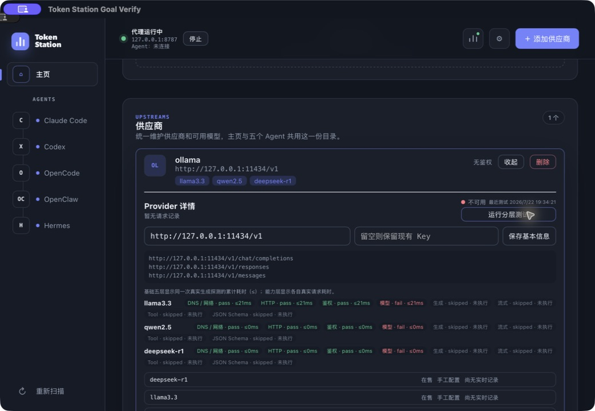

# 第二批协作任务：T1 Provider 详情闭环验收

> 日期：2026-07-22
> 范围：#1 Provider 详情页闭环、分层测试耗时、健康三色徽章
> 结论：自动化总门和独立 Debug App 复验通过

## 1. Gap-only 交付

既有 T8 已提供 Provider 编辑、最终 URL、可信目录、目录 diff、能力、无正文用量、引用预览和软删除。本阶段只补缺口：

- 分层测试的每个阶段增加 `duration_ms` 和计时语义；
- 基础五层由同一次真实生成请求分类，显示累计耗时 `≤Nms`，不伪装为独立网络阶段；
- 流式、Tool、JSON Schema 各自执行真实请求并记录独立耗时；
- 新增健康徽章：基础链路失败为红色“不可用”，基础通过但能力层失败为黄色“能力退化”，八层全通过为绿色“健康”；
- 徽章显示最近一次成功取得测试结果的本地时间；
- Provider 卡片入口由“管理模型”更名为“管理详情”，准确表达单页生命周期入口。

## 2. 自动化验收

```text
cargo test -p token-station-cli
结果：unit/main/plugin devchain/plugin install/proxy/upgrade/doc 全部通过；proxy 50 passed, 1 ignored

cargo test --manifest-path apps/desktop/src-tauri/Cargo.toml
结果：lib 151 passed, 1 ignored；yaml regression 3 passed

cargo clippy -p token-station-cli --all-targets -- -D warnings
cargo clippy --manifest-path apps/desktop/src-tauri/Cargo.toml --all-targets -- -D warnings
结果：两者均通过，0 warning

npm test -- --run
结果：11 files passed，106 tests passed

npm run build
结果：TypeScript 与 Vite production build 通过
```

前端验收覆盖：八层耗时文本、累计/阶段计时差异、最近测试时间、绿/黄/红健康判定。CLI 集成测试额外验证三个能力探测结果都序列化 `duration_ms`。

## 3. 独立 Debug App 复验

为避免与用户已安装版的相同 bundle id 混淆，使用当前源码构建独立验收包：

```text
npx tauri build --debug --bundles app \
  --config '{"productName":"Token Station Goal Verify","identifier":"com.tokenstation.goalverify",...}'
```

在 `Token Station Goal Verify.app` 中：

1. 新增无凭据的本地 Ollama Provider；
2. 确认卡片入口为“管理详情”；
3. 展开后在同一页面看到基本信息、最终 URL、健康、可信目录、用量、模型管理和删除入口；
4. 配置临时路由池并运行真实分层测试；
5. 本机 Ollama 只有 embedding 模型，三个语言模型在模型层诚实失败，生成和能力层为 skipped；
6. 页面显示红色“不可用”、最近测试时间、各层状态和耗时，未把失败当成功；
7. 验收后停止临时代理并关闭验收 App。

截图：

## 4. 通过条件映射

- 一页生命周期：通过，新增入口与详情页实机可达。
- 每层结果与耗时：通过，基础累计计时和能力独立计时均显式说明。
- 健康三色：通过，自动化覆盖绿/黄/红，实机验证红色失败态。
- 目录刷新不误删：沿用 T8 的 active/stale/removed 与引用保护，全量回归通过。
- 删除保护：沿用两阶段引用预览和 tombstone 恢复，全量回归通过。
