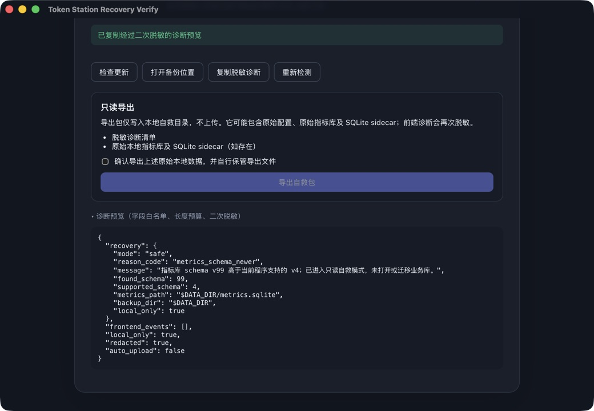

# 第二批协作任务：T7 自救壳验收

> 日期：2026-07-23
> 范围：#7 DB 版本过新与前端崩溃自救
> 结论：实现、自动化与隔离真实 App 验收全部通过

## 1. 通过能力

- 未来 schema 通过 read-only SQLite connection 分类；源库 bytes、`user_version=99` 和 canary `future-row` 在启动、预览、导出和重试后均保持不变。
- safe mode 只管理 `DesktopPaths`，不管理 `AppStateManaged` 或 `AgentCommandState`；真实 App 未挂载业务导航，只暴露检查更新、打开备份位置、复制诊断、重新检测和确认后导出。
- React bootstrap 在挂载业务 App 前取得兼容性状态；`RecoveryBoundary`、`window.onerror` 和 `unhandledrejection` 使用同一诊断链。可控 render error 由组件自动化覆盖，生产隔离包未加入测试后门。
- 日志采用字段白名单、单字段/文件预算、`0600` 本地持久化和读写二次脱敏；诊断预览与复制内容中的本地路径固定映射为 `$DATA_DIR`。
- 原始导出必须明确勾选确认；有效 DB 使用 SQLite online backup，损坏 DB 使用 raw + sidecar fallback；manifest 明确 `local_only=true`、`auto_upload=false`、`contains_raw_local_data=true`。

## 2. 真实 App 验收

隔离应用与数据：

```text
App: apps/desktop/src-tauri/target/debug/bundle/macos/Token Station Recovery Verify.app
bundle id: com.tokenstation.recoveryverify
source SHA-256: 470ca7ea36f068ca21584612f0ce0316217ef6f8a255dd2ec69ed47338d81735
source SQLite: user_version=99, future_data=future-row
```

通过 Computer Use 完成以下操作：

1. 启动后直接显示“Token Station 自救模式”和 `v99 > v4` 兼容性保护，没有业务导航或业务写操作。
2. 未勾选时“导出自救包”保持禁用；勾选后成功生成本地导出包。
3. 导出库仍为 `user_version=99` 且包含 `future-row`；源库最终哈希仍为上述原值。
4. 展开诊断预览后，`metrics_path` 为 `$DATA_DIR/metrics.sqlite`、`backup_dir` 为 `$DATA_DIR`；点击复制后 UI 显示“已复制经过二次脱敏的诊断预览”。
5. 留存截图只包含脱敏占位符，不包含 `/Users/...` 绝对路径：`assets/2026-07-23-T7-recovery-diagnostics-redacted.jpeg`。



## 3. 实机发现与 TDD 修复

首次真实导出发现导出目录/文件沿用默认 `0755/0644`，会让同机其他账号读取原始 DB。先在既有导出测试中加入 `0700/0600` 断言并确认 RED，再实现私有权限收敛；第二、第三次真实导出均得到：

```text
recovery-exports/                                  drwx------
recovery-export-1784772003754/                     drwx------
recovery-export-1784772003754/metrics.sqlite       -rw-------
recovery-export-1784772003754/frontend-diagnostics.jsonl -rw-------
recovery-export-1784772003754/manifest.json        -rw-------
```

随后展开真实诊断预览时发现其虽然标为“二次脱敏”，仍使用包含用户名的绝对路径。新增 Rust 后端预览测试和 React 复制诊断测试，确认 RED 后完成两层修复：后端只返回 `$DATA_DIR` 占位符，前端只从后端脱敏预览生成可复制 JSON。修复后的隔离 App 已再次构建、签名并实机复验通过。

## 4. 最终 Fresh verification

```text
cargo fmt --check                                                        PASS
cargo fmt --manifest-path apps/desktop/src-tauri/Cargo.toml -- --check  PASS
cargo clippy --workspace --all-targets -- -D warnings                   PASS
cargo clippy --manifest-path apps/desktop/src-tauri/Cargo.toml --all-targets -- -D warnings PASS
cargo test --workspace                                                   PASS
cargo test --manifest-path apps/desktop/src-tauri/Cargo.toml            PASS
  Desktop lib: 164 passed / 1 ignored
  YAML regression: 3 passed
RUSTDOCFLAGS="-D warnings" cargo doc --workspace --no-deps              PASS
npm run test:coverage                                                    PASS (16 files / 134 tests)
npm run build                                                            PASS
git diff --check                                                         PASS
```

隔离调试包还通过 `codesign --verify --deep --strict`、Wasmtime executable-memory entitlement、源码 checkout 绝对路径脱除和五个 builtin plugin marker 检查。该签名仅用于本地隔离验收，不代表生产发布签名或 notarization。
